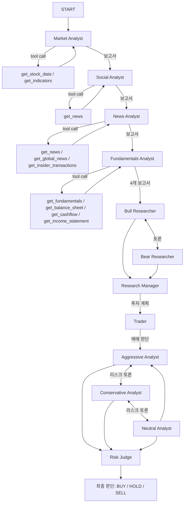

# 🐜 G-ANT Trader

**"개미는 뚠뚠, 오늘도 뚠뚠... 하지만 스마트하게!"**

[TradingAgents](https://github.com/virattt/TradingAgents) 프레임워크를 기반으로, Google Antigravity 엔진(Gemini 3 Pro / Gemini 2.5 Pro)을 탑재한 무료 AI 주식 분석 시스템입니다. 여러 전문 에이전트가 토론과 리스크 분석을 거쳐 매수/매도/관망 판단을 내립니다.

---

## 아키텍처

### 멀티 에이전트 시스템

이 시스템은 하나의 AI가 아닌 **역할이 다른 여러 에이전트**의 협업으로 의사결정을 내립니다.

| 역할             | 에이전트                              | 설명                                                   |
| ---------------- | ------------------------------------- | ------------------------------------------------------ |
| **Analyst**      | Market / Social / News / Fundamentals | 각각 시장 데이터, 소셜 센티먼트, 뉴스, 재무제표를 분석 |
| **Researcher**   | Bull / Bear                           | 낙관/비관 시나리오를 각각 옹호하며 토론                |
| **Risk Manager** | Risk Analyst                          | 포지션 리스크, 변동성, 최대 손실을 평가                |
| **Trader**       | Portfolio Trader                      | 최종 매수/매도/관망 판단과 비중 결정                   |

### 분석 흐름

```
[데이터 수집] → [4종 Analyst 보고서] → [Bull vs Bear 토론]
      → [Risk Manager 평가] → [Trader 최종 판단] → [결과 리포트]
```

토론 라운드 수는 `max_debate_rounds`와 `max_risk_discuss_rounds`로 조절됩니다 (기본: 1라운드).

### 데이터 소스

시장 데이터는 **yfinance**를 기본 데이터 벤더로 사용합니다. Alpha Vantage로 전환하려면 `ALPHA_VANTAGE_API_KEY` 환경변수 설정 후 config의 `data_vendors`를 수정하면 됩니다.

수집 데이터:

- 주가/거래량/기술 지표 (SMA, RSI, MACD 등)
- 재무제표 (손익계산서, 대차대조표, 현금흐름표)
- 내부자 거래 내역
- 뉴스 헤드라인 및 글로벌 뉴스

---

## LLM Provider

API 키 없이 **Google OAuth 인증만으로** Gemini 모델을 사용합니다. 두 가지 provider를 지원합니다.

| Provider            | 모델                       | 인증 파일                    | 특징                     |
| ------------------- | -------------------------- | ---------------------------- | ------------------------ |
| `gemini-cli` (기본) | gemini-2.5-pro, 2.5-flash  | `~/.gemini/oauth_creds.json` | Gemini CLI의 토큰 재사용 |
| `antigravity`       | gemini-3-pro-high, 3-flash | `~/.antigravity_tokens.json` | 자체 OAuth 플로우        |

### 모델 매핑

`gemini-cli` provider 사용 시, config의 모델명은 자동으로 매핑됩니다:

| Config 모델명       | 실제 호출 모델     |
| ------------------- | ------------------ |
| `gemini-3-flash`    | `gemini-2.5-flash` |
| `gemini-3-pro`      | `gemini-2.5-pro`   |
| `gemini-3-pro-high` | `gemini-2.5-pro`   |

### 인증 방식

1. **Refresh Token** (env 변수): `GEMINI_CLI_REFRESH_TOKEN` 또는 `ANTIGRAVITY_REFRESH_TOKEN` 설정 시 자동 토큰 갱신. CI/headless 환경에 적합.
2. **캐시 파일**: 이전 인증에서 저장된 토큰 파일을 자동 로드. 토큰 만료 시 refresh token으로 갱신.
3. **브라우저 OAuth**: 위 두 방법이 모두 실패하면 브라우저가 열려 Google 로그인을 요청합니다.

우선순위: **env 변수 → 캐시 파일 → 브라우저 인증**

### Resilience

API 호출 실패 시 자동 복구:

- **429 (Rate Limit)**: 30초 대기 후 동일 모델로 재시도 (최대 5회)
- **503 (Capacity)**: 폴백 모델로 자동 전환 (`2.5-pro → 2.5-flash`, `3-pro-high → 3-pro-low → 3-flash`)

---

## 설치 및 실행

### Prerequisites

- Python 3.10+
- (선택) `gemini-cli` 설치 및 인증:
  ```bash
  npm install -g @google/gemini-cli
  gemini   # 최초 실행 시 브라우저 인증
  ```

### Install

```bash
git clone https://github.com/samdae/g-ant-trader.git
cd g-ant-trader
pip install -r requirements.txt
```

### Run

```bash
python main.py
```

`main.py`에서 종목, 날짜, 모델 등을 직접 설정합니다. 기본 설정은 `default_config.py`에서 읽고, `.env`로 override할 수 있습니다.

CLI wizard를 사용하려면 `python -m cli.main` 또는 `tradingagents` 명령을 실행하세요. wizard는 6단계로 분석을 설정합니다:

1. **종목 선택** — 티커 심볼 입력 (예: AAPL, TSLA)
2. **분석 날짜** — 분석 기준일 선택
3. **애널리스트 팀** — market, social, news, fundamentals 중 선택
4. **리서치 깊이** — 토론 라운드 수 결정
5. **LLM Provider** — gemini-cli 또는 antigravity 선택
6. **모델 선택** — shallow/deep thinking 모델 지정

### 환경변수 설정

`.env` 파일로 기본값을 설정할 수 있습니다 (`.env.example` 참고):

```env
# Provider 기본값 (CLI wizard에서도 변경 가능)
LLM_PROVIDER=gemini-cli

# Headless 인증용 Refresh Token (선택)
GEMINI_CLI_REFRESH_TOKEN=<your-token>
ANTIGRAVITY_REFRESH_TOKEN=<your-token>

# Alpha Vantage (yfinance 대신 사용 시)
ALPHA_VANTAGE_API_KEY=<your-key>
```

---

## 주요 설정 (default_config.py)

| 키                        | 기본값                             | 설명                          |
| ------------------------- | ---------------------------------- | ----------------------------- |
| `llm_provider`            | `gemini-cli` (env: `LLM_PROVIDER`) | LLM provider 선택             |
| `deep_think_llm`          | `gemini-3-pro-high`                | 심층 분석용 모델              |
| `quick_think_llm`         | `gemini-3-flash`                   | 빠른 판단용 모델              |
| `max_debate_rounds`       | 1                                  | Bull vs Bear 토론 라운드 수   |
| `max_risk_discuss_rounds` | 1                                  | 리스크 논의 라운드 수         |
| `data_vendors`            | 모두 `yfinance`                    | 데이터 소스 벤더 (카테고리별) |

---

## 분석 파이프라인 상세

### 전체 흐름도



### Phase 1: 데이터 수집 및 분석 (4종 Analyst)

모든 Analyst는 `quick_think_llm` (기본: `gemini-3-flash`)을 사용합니다. 각 Analyst는 LLM에 tool이 바인딩되어, **LLM이 직접 어떤 tool을 어떤 파라미터로 호출할지 판단**합니다.

#### Market Analyst

주가와 기술 지표를 분석합니다.

**바인딩된 Tools:**

| Tool             | 시그니처                                            | 반환 데이터                                |
| ---------------- | --------------------------------------------------- | ------------------------------------------ |
| `get_stock_data` | `(symbol, start_date, end_date)`                    | OHLCV CSV (Open, High, Low, Close, Volume) |
| `get_indicators` | `(symbol, indicator, curr_date, look_back_days=30)` | 지정 기간의 일별 지표값 + 지표 설명        |

**인디케이터 선택 방식:**

시스템 프롬프트에 15개 지표 목록과 각 지표의 용도/주의사항이 주어지고, LLM에게 **"상호 보완적인 최대 8개를 선택하라, 중복을 피하라"** 고 지시합니다. LLM은 시장 상황을 판단하여 자율적으로 선택하고, `get_indicators` tool을 **지표 1개당 1회씩 호출**합니다.

**사용 가능한 15개 지표:**

| 카테고리 | 지표            | 설명                                                  |
| -------- | --------------- | ----------------------------------------------------- |
| 이동평균 | `close_50_sma`  | 50일 단순이동평균 — 중기 추세                         |
|          | `close_200_sma` | 200일 단순이동평균 — 장기 추세, 골든크로스/데드크로스 |
|          | `close_10_ema`  | 10일 지수이동평균 — 단기 모멘텀                       |
| MACD     | `macd`          | EMA 차이 기반 모멘텀                                  |
|          | `macds`         | MACD 시그널 라인                                      |
|          | `macdh`         | MACD 히스토그램 — 모멘텀 강도 시각화                  |
| 모멘텀   | `rsi`           | RSI — 과매수(70↑)/과매도(30↓)                         |
| 변동성   | `boll`          | 볼린저 밴드 중간선 (20 SMA)                           |
|          | `boll_ub`       | 볼린저 상단밴드 (+2σ)                                 |
|          | `boll_lb`       | 볼린저 하단밴드 (-2σ)                                 |
|          | `atr`           | ATR — 평균 진폭, 변동성 측정                          |
| 거래량   | `vwma`          | 거래량 가중 이동평균                                  |
|          | `mfi`           | MFI — 매수/매도 압력 (가격+거래량)                    |

**백룩 기간:** tool의 `look_back_days` 파라미터로 LLM이 결정 (기본값 30일).

**출력:** 각 지표의 일별 값과 추세를 종합한 상세 보고서 + Markdown 테이블.

#### Social Media Analyst

소셜미디어와 개별 종목 뉴스를 분석하여 센티먼트를 평가합니다.

**바인딩된 Tool:**

| Tool       | 시그니처                         | 반환 데이터                                      |
| ---------- | -------------------------------- | ------------------------------------------------ |
| `get_news` | `(ticker, start_date, end_date)` | yfinance 뉴스 최대 20건 (제목, 요약, 출처, 링크) |

**분석 관점:** 종목 관련 소셜미디어 논의, 일별 투자 센티먼트 변화, 기업 관련 최신 뉴스. 같은 `get_news` tool이지만 프롬프트가 소셜/센티먼트 분석 관점으로 작성됨.

**출력:** 센티먼트 보고서 (`sentiment_report`).

#### News Analyst

글로벌 매크로 뉴스, 종목 뉴스, 내부자 거래를 종합 분석합니다.

**바인딩된 Tools:**

| Tool                       | 시그니처                                 | 반환 데이터                                                                         |
| -------------------------- | ---------------------------------------- | ----------------------------------------------------------------------------------- |
| `get_news`                 | `(ticker, start_date, end_date)`         | 종목별 뉴스 최대 20건                                                               |
| `get_global_news`          | `(curr_date, look_back_days=7, limit=5)` | 글로벌 매크로 뉴스 (4가지 주제 검색: 증시/경제, 연준/금리, 인플레이션, 글로벌 시장) |
| `get_insider_transactions` | `(ticker)`                               | 임원/내부자의 주식 매매 내역                                                        |

**출력:** 뉴스 보고서 (`news_report`).

#### Fundamentals Analyst

재무제표와 기업 기본 정보를 분석합니다.

**바인딩된 Tools:**

| Tool                   | 시그니처                     | 반환 데이터                                                                                     |
| ---------------------- | ---------------------------- | ----------------------------------------------------------------------------------------------- |
| `get_fundamentals`     | `(ticker)`                   | 28개 핵심 지표 (시가총액, P/E, PEG, ROE, ROA, 매출, 순이익, 이익률, 부채비율, 유동비율, FCF 등) |
| `get_balance_sheet`    | `(ticker, freq="quarterly")` | 대차대조표 CSV (분기/연간)                                                                      |
| `get_cashflow`         | `(ticker, freq="quarterly")` | 현금흐름표 CSV (분기/연간)                                                                      |
| `get_income_statement` | `(ticker, freq="quarterly")` | 손익계산서 CSV (분기/연간)                                                                      |

**`get_fundamentals`가 반환하는 28개 지표:**
시가총액, P/E(TTM), Forward P/E, PEG, P/B, EPS(TTM), Forward EPS, 배당수익률, Beta, 52주 고가/저가, 50/200일 평균가, 매출(TTM), 매출총이익, EBITDA, 순이익, 이익률, 영업이익률, ROE, ROA, 부채비율, 유동비율, 장부가치, FCF.

**출력:** 재무 보고서 (`fundamentals_report`).

---

### Phase 2: 투자 토론 (Bull vs Bear)

4개 보고서(`market_report`, `sentiment_report`, `news_report`, `fundamentals_report`)가 Bull/Bear Researcher에게 전달됩니다.

| 에이전트            | 역할                                                    | LLM               |
| ------------------- | ------------------------------------------------------- | ----------------- |
| **Bull Researcher** | 매수 논거 제시 — 성장 잠재력, 경쟁 우위, 긍정 지표 강조 | `quick_think_llm` |
| **Bear Researcher** | 매도 논거 제시 — 리스크, 경쟁 약점, 부정 지표 강조      | `quick_think_llm` |

**토론 구조:**

1. Bull이 먼저 주장 → Bear가 반박 → Bull이 재반박 ...
2. `max_debate_rounds` 만큼 반복 (기본: 1라운드 = Bull 1회 + Bear 1회)
3. 각 라운드에서 상대방의 이전 주장(`current_response`)과 전체 토론 히스토리(`history`)를 참조
4. **Memory 시스템**: 과거 유사 상황에서의 판단과 그 결과를 `memory.get_memories()`로 조회하여 과거 실수에서 학습

---

### Phase 3: Research Manager (투자 계획 수립)

Bull/Bear 토론 결과를 종합하여 구체적인 투자 계획(`investment_plan`)을 수립합니다.

| 항목 | 값                                                            |
| ---- | ------------------------------------------------------------- |
| LLM  | `deep_think_llm` (기본: `gemini-3-pro-high`) — 심층 분석 필요 |
| 입력 | Bull/Bear 토론 히스토리 + 4개 보고서 + 과거 Memory            |
| 출력 | `investment_plan` — Trader에게 전달                           |

---

### Phase 4: Trader (매매 판단)

Research Manager의 투자 계획을 받아 **BUY / HOLD / SELL** 결정을 내립니다.

| 항목 | 값                                                                                            |
| ---- | --------------------------------------------------------------------------------------------- |
| LLM  | `quick_think_llm`                                                                             |
| 입력 | `investment_plan` + 과거 Memory                                                               |
| 출력 | `trader_investment_plan` — 구체적 매매 근거 + `FINAL TRANSACTION PROPOSAL: **BUY/HOLD/SELL**` |

---

### Phase 5: 리스크 토론 (3인 토론)

Trader의 매매 판단에 대해 3가지 관점의 리스크 분석가가 토론합니다.

| 에이전트                 | 관점   | 역할                                      |
| ------------------------ | ------ | ----------------------------------------- |
| **Aggressive Analyst**   | 공격적 | 고위험-고수익 기회 옹호, 보수적 관점 반박 |
| **Conservative Analyst** | 보수적 | 리스크 강조, 안전 마진/헤지 전략 제안     |
| **Neutral Analyst**      | 중립   | 양쪽 균형, 데이터 기반 중재               |

**토론 구조:**

1. Aggressive → Conservative → Neutral → Aggressive ... 순환
2. `max_risk_discuss_rounds` 만큼 반복 (기본: 1라운드 = 3인 각 1회)
3. 각 분석가는 4개 보고서 + Trader 판단 + 다른 분석가의 이전 주장을 참조

---

### Phase 6: Risk Judge (최종 판결)

리스크 토론 결과를 최종 종합하여 **투자 결정을 확정**합니다.

| 항목 | 값                                                            |
| ---- | ------------------------------------------------------------- |
| LLM  | `deep_think_llm` (기본: `gemini-3-pro-high`) — 최종 심층 판단 |
| 입력 | 리스크 토론 히스토리 + 4개 보고서 + Trader 판단 + 과거 Memory |
| 출력 | `final_trade_decision` — **BUY / HOLD / SELL** + 근거         |

---

### 모델 배정 요약

| LLM                                  | 용도                         | 사용 에이전트                            |
| ------------------------------------ | ---------------------------- | ---------------------------------------- |
| `quick_think_llm` (gemini-3-flash)   | 데이터 수집, 빠른 분석, 토론 | 4종 Analyst, Bull/Bear, Trader, Risk 3인 |
| `deep_think_llm` (gemini-3-pro-high) | 심층 종합 판단               | Research Manager, Risk Judge             |

### Memory 시스템

Bull, Bear, Trader, Research Manager, Risk Judge에는 각각 독립된 Memory가 있습니다. `reflect_and_remember(returns)` 호출 시 실제 수익/손실 데이터를 기반으로 과거 판단을 반성하고, 다음 분석에서 유사 상황 조회 시 활용합니다.

---

## ⚠️ Disclaimer

이 소프트웨어는 교육 및 연구 목적으로만 제공됩니다. 실제 투자에 대한 책임은 전적으로 사용자에게 있습니다.
**Antigravity API 사용은 Google의 정책에 따라 제한될 수 있습니다.**

---

_Maintained by DH & Deuk-gu_
