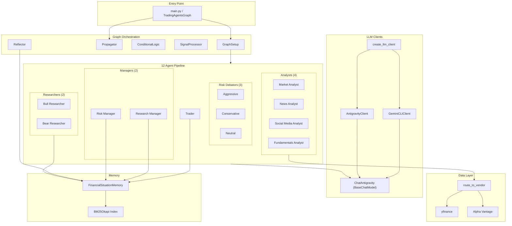
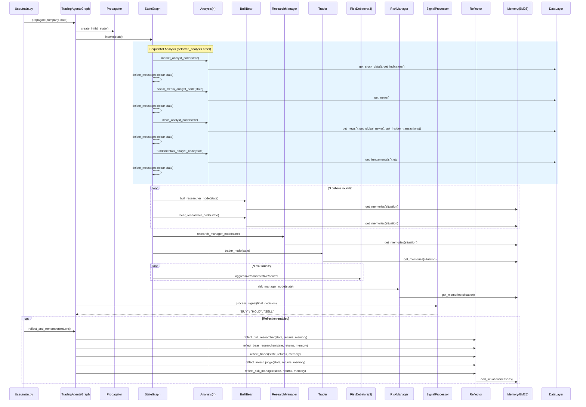

# TradingAgents Backend Design Doc (Reverse-engineered)

> ⚠️ This document was reverse-engineered from code.
> - **Extracted**: Code Mapping, Tech Stack, Architecture (reliable)
> - **Inferred**: Goal, Scope, Sequence (requires verification)
> - **Unconfirmed**: Risks, Tradeoffs (enhance with reinforce)

## 1. Summary

### 1.1 Goal
Multi-agent LLM pipeline for stock investment analysis. 12 specialized agents collaborate through debate, risk assessment, and reflection to produce BUY/HOLD/SELL decisions.

### 1.2 Non-goals
- No actual trade execution (no broker API)
- No data persistence (transient fetch only)
- No portfolio management (single-ticker analysis per run)

## 1.5 Tech Stack

| Category | Technology |
|----------|-----------|
| Language | Python 3.10+ |
| Agent Orchestration | LangGraph (StateGraph) |
| LLM Framework | LangChain (ChatPromptTemplate, tool binding) |
| LLM Provider | Google Gemini via OAuth (gemini-cli / antigravity) |
| Stock Data | yfinance (primary), Alpha Vantage (fallback) |
| Technical Indicators | stockstats (via StockstatsUtils wrapper) |
| Memory/Retrieval | rank_bm25 (BM25Okapi) |
| Dependencies | pandas, numpy, dateutil, requests |

---

## 2. Architecture Impact

### 2.1 Component Diagram



### 2.2 Sequence Diagram (Single Analysis Run)



---

## 3. Code Mapping

| # | Spec Ref | Feature | File | Class/Function | Method | Action | Impl |
|---|----------|---------|------|----------------|--------|--------|------|
| 1 | FR-001 | Market Analysis | agents/analysts/market_analyst.py | create_market_analyst | market_analyst_node | LLM selects indicators, fetches data, generates report | [x] |
| 2 | FR-001 | News Analysis | agents/analysts/news_analyst.py | create_news_analyst | news_analyst_node | Fetches news via tools, generates report | [x] |
| 3 | FR-001 | Social Analysis | agents/analysts/social_media_analyst.py | create_social_media_analyst | social_media_analyst_node | Analyzes sentiment/social media, generates report | [x] |
| 4 | FR-001 | Fundamentals Analysis | agents/analysts/fundamentals_analyst.py | create_fundamentals_analyst | fundamentals_analyst_node | Fetches financials, generates report | [x] |
| 5 | FR-002 | Bull Debate | agents/researchers/bull_researcher.py | create_bull_researcher | bull_node | Constructs bullish case with memory | [x] |
| 6 | FR-002 | Bear Debate | agents/researchers/bear_researcher.py | create_bear_researcher | bear_node | Constructs bearish case with memory | [x] |
| 7 | FR-003 | Debate Judge | agents/managers/research_manager.py | create_research_manager | research_manager_node | Evaluates debate, decides BUY/HOLD/SELL plan | [x] |
| 8 | FR-004 | Trade Proposal | agents/trader/trader.py | create_trader | trader_node | Generates specific trade decision with memory | [x] |
| 9 | FR-005 | Aggressive Risk | agents/risk_mgmt/aggressive_debator.py | create_aggressive_debator | aggressive_node | Champions high-risk opportunities | [x] |
| 10 | FR-005 | Conservative Risk | agents/risk_mgmt/conservative_debator.py | create_conservative_debator | conservative_node | Advocates capital preservation | [x] |
| 11 | FR-005 | Neutral Risk | agents/risk_mgmt/neutral_debator.py | create_neutral_debator | neutral_node | Provides balanced perspective | [x] |
| 12 | FR-006 | Risk Judge | agents/managers/risk_manager.py | create_risk_manager | risk_manager_node | Final verdict after risk debate | [x] |
| 13 | FR-007 | Memory Store | agents/utils/memory.py | FinancialSituationMemory | add_situations | Stores situation+recommendation pairs, builds BM25 index | [x] |
| 14 | FR-007 | Memory Query | agents/utils/memory.py | FinancialSituationMemory | get_memories | BM25 search for similar past situations | [x] |
| 15 | FR-008 | Reflection Orchestrator | graph/trading_graph.py | TradingAgentsGraph | reflect_and_remember | Calls 5 agent-specific reflect methods on Reflector | [x] |
| 16 | FR-008 | Bull Reflection | graph/reflection.py | Reflector | reflect_bull_researcher | Reflects on bull debate history → stores lesson | [x] |
| 17 | FR-008 | Bear Reflection | graph/reflection.py | Reflector | reflect_bear_researcher | Reflects on bear debate history → stores lesson | [x] |
| 17b | FR-008 | Trader Reflection | graph/reflection.py | Reflector | reflect_trader | Reflects on trader decision → stores lesson | [x] |
| 17c | FR-008 | Judge Reflection | graph/reflection.py | Reflector | reflect_invest_judge | Reflects on investment judge decision → stores lesson | [x] |
| 17d | FR-008 | Risk Reflection | graph/reflection.py | Reflector | reflect_risk_manager | Reflects on risk manager decision → stores lesson | [x] |
| 18 | FR-009 | Signal Extract | graph/signal_processing.py | SignalProcessor | process_signal | LLM extracts BUY/HOLD/SELL from verbose text | [x] |
| 19 | FR-010 | Vendor Router | dataflows/interface.py | — | route_to_vendor | Routes data calls to configured vendor with fallback | [x] |
| 20 | FR-010 | Stock Data (yf) | dataflows/y_finance.py | — | get_YFin_data_online | Fetches OHLCV from yfinance | [x] |
| 21 | FR-010 | Indicators (yf) | dataflows/y_finance.py | — | get_stockstats_indicator | Calculates technical indicators via stockstats | [x] |
| 22 | FR-010 | Fundamentals (yf) | dataflows/y_finance.py | — | get_fundamentals | Company info, financials from yfinance | [x] |
| 23 | FR-010 | News (yf) | dataflows/yfinance_news.py | — | get_news_yfinance | Ticker-specific news from yfinance | [x] |
| 24 | FR-010 | Global News (yf) | dataflows/yfinance_news.py | — | get_global_news_yfinance | Macro/global news via yfinance Search | [x] |
| 25 | FR-010 | Stock Data (AV) | dataflows/alpha_vantage_stock.py | — | get_stock | OHLCV from Alpha Vantage API | [x] |
| 26 | FR-010 | Indicators (AV) | dataflows/alpha_vantage_indicator.py | — | get_indicator | Technical indicators from Alpha Vantage | [x] |
| 27 | FR-010 | News (AV) | dataflows/alpha_vantage_news.py | — | get_news | News from Alpha Vantage | [x] |
| 28 | FR-011 | LLM Factory | llm_clients/factory.py | — | create_llm_client | Creates LLM client by provider name | [x] |
| 29 | FR-011 | Auth (Antigravity) | llm_clients/antigravity_client.py | AntigravityAuth | ensure_token | OAuth token management with PKCE | [x] |
| 30 | FR-011 | Auth (Gemini CLI) | llm_clients/gemini_cli_client.py | GeminiCLIClient | get_llm | Reuses gemini-cli cached OAuth tokens | [x] |
| 31 | FR-012 | Resilience | llm_clients/antigravity_client.py | ChatAntigravity | _generate | Rate limit retry, 503 handling, model downgrade | [x] |
| 32 | — | Graph Build | graph/setup.py | GraphSetup | setup_graph | Builds LangGraph StateGraph with all nodes/edges | [x] |
| 33 | — | State Init | graph/propagation.py | Propagator | create_initial_state | Creates initial AgentState for graph invocation | [x] |
| 34 | — | Flow Control | graph/conditional_logic.py | ConditionalLogic | should_continue_debate | Debate round counter logic | [x] |
| 35 | — | Flow Control | graph/conditional_logic.py | ConditionalLogic | should_continue_risk_analysis | Risk debate round counter logic | [x] |
| 36 | — | Orchestrator | graph/trading_graph.py | TradingAgentsGraph | propagate | Top-level: init → run graph → extract signal → log | [x] |
| 37 | — | State Mgmt | agents/utils/agent_utils.py | create_msg_delete | delete_messages | Clears LangGraph messages between pipeline phases | [x] |
| 38 | — | Config | dataflows/config.py | — | get_config/set_config | Global config management (vendor, LLM, rounds) | [x] |
| 39 | — | State Def | agents/utils/agent_states.py | AgentState | — | TypedDict for LangGraph state | [x] |
| 40 | — | State Def | agents/utils/agent_states.py | InvestDebateState | — | TypedDict for investment debate | [x] |
| 41 | — | State Def | agents/utils/agent_states.py | RiskDebateState | — | TypedDict for risk debate | [x] |

### Tool Functions (used by Analysts via LangChain tool binding)

| # | Tool | File | Used By | Data Source |
|---|------|------|---------|------------|
| 1 | `get_stock_data` | agents/utils/core_stock_tools.py | Market Analyst | yfinance / Alpha Vantage |
| 2 | `get_indicators` | agents/utils/technical_indicators_tools.py | Market Analyst | stockstats (yfinance) / Alpha Vantage |
| 3 | `get_fundamentals` | agents/utils/fundamental_data_tools.py | Fundamentals Analyst | yfinance / Alpha Vantage |
| 4 | `get_balance_sheet` | agents/utils/fundamental_data_tools.py | Fundamentals Analyst | yfinance / Alpha Vantage |
| 5 | `get_cashflow` | agents/utils/fundamental_data_tools.py | Fundamentals Analyst | yfinance / Alpha Vantage |
| 6 | `get_income_statement` | agents/utils/fundamental_data_tools.py | Fundamentals Analyst | yfinance / Alpha Vantage |
| 7 | `get_news` | agents/utils/news_data_tools.py | News/Social Analyst | yfinance / Alpha Vantage |
| 8 | `get_global_news` | agents/utils/news_data_tools.py | News Analyst | yfinance / Alpha Vantage |
| 9 | `get_insider_transactions` | agents/utils/news_data_tools.py | News Analyst | yfinance / Alpha Vantage |

---

## 4. Module Structure

```
tradingagents/                          # Root package
├── default_config.py                   # DEFAULT_CONFIG dict
├── agents/                             # 12 AI agents
│   ├── analysts/                       # Phase 1: Data analysis (4 agents)
│   │   ├── market_analyst.py           #   Technical market analysis
│   │   ├── news_analyst.py             #   News & macro analysis
│   │   ├── social_media_analyst.py     #   Social sentiment analysis
│   │   └── fundamentals_analyst.py     #   Financial statement analysis
│   ├── researchers/                    # Phase 2: Investment debate (2 agents)
│   │   ├── bull_researcher.py          #   Bullish thesis
│   │   └── bear_researcher.py          #   Bearish thesis
│   ├── managers/                       # Phase 3 & 5: Judges (2 agents)
│   │   ├── research_manager.py         #   Investment debate judge
│   │   └── risk_manager.py             #   Risk debate judge
│   ├── trader/                         # Phase 4: Trade proposal (1 agent)
│   │   └── trader.py                   #   BUY/HOLD/SELL with strategy
│   ├── risk_mgmt/                      # Phase 5: Risk assessment (3 agents)
│   │   ├── aggressive_debator.py       #   High-risk advocate
│   │   ├── conservative_debator.py     #   Low-risk advocate
│   │   └── neutral_debator.py          #   Balanced perspective
│   └── utils/                          # Agent utilities
│       ├── agent_states.py             #   LangGraph state TypedDicts
│       ├── agent_utils.py              #   Tool re-exports, message clearing
│       ├── memory.py                   #   FinancialSituationMemory (BM25)
│       ├── core_stock_tools.py         #   @tool: stock data
│       ├── technical_indicators_tools.py  #   @tool: indicators
│       ├── fundamental_data_tools.py   #   @tool: financials (4 tools)
│       └── news_data_tools.py          #   @tool: news (3 tools)
├── graph/                              # Orchestration layer
│   ├── trading_graph.py                #   TradingAgentsGraph (main entry)
│   ├── setup.py                        #   GraphSetup (build StateGraph)
│   ├── propagation.py                  #   Propagator (state init)
│   ├── conditional_logic.py            #   Debate/risk round control
│   ├── signal_processing.py            #   Extract BUY/HOLD/SELL
│   └── reflection.py                   #   Post-decision learning
├── llm_clients/                        # LLM provider abstraction
│   ├── factory.py                      #   create_llm_client()
│   ├── base_client.py                  #   BaseLLMClient (ABC)
│   ├── antigravity_client.py           #   AntigravityClient + ChatAntigravity + Auth
│   ├── gemini_cli_client.py            #   GeminiCLIClient (reuse gemini-cli tokens)
│   └── validators.py                   #   Model validation (always True)
└── dataflows/                          # Data fetching abstraction
    ├── interface.py                    #   route_to_vendor() with fallback
    ├── config.py                       #   get_config/set_config
    ├── y_finance.py                    #   yfinance: stock, indicators, fundamentals
    ├── yfinance_news.py                #   yfinance: news (ticker + global)
    ├── stockstats_utils.py             #   StockstatsUtils wrapper
    ├── utils.py                        #   Data formatting utilities
    ├── alpha_vantage.py                #   AV module re-exports
    ├── alpha_vantage_stock.py          #   AV: stock data
    ├── alpha_vantage_indicator.py      #   AV: technical indicators
    ├── alpha_vantage_fundamentals.py   #   AV: financial statements
    ├── alpha_vantage_news.py           #   AV: news + insider transactions
    └── alpha_vantage_common.py         #   AV: shared utilities
```

---

## 5. Key Design Patterns

### 5.1 Factory Pattern
- `create_llm_client(provider, model)` → `BaseLLMClient` subclass
- `create_{agent}(llm, memory?)` → closure-based graph node function

### 5.2 Closure-based Agents
Each agent is a factory function that returns a closure (not a class):
```python
def create_bull_researcher(llm, memory):
    def bull_node(state) -> dict:
        # ... agent logic ...
        return {"investment_debate_state": new_state}
    return bull_node
```
This pattern allows LLM and memory to be injected at graph build time.

### 5.3 Vendor Abstraction with Fallback
```python
route_to_vendor("get_stock_data", symbol, start, end)
# → tries yfinance first
# → on failure, tries alpha_vantage
# → raises RuntimeError if all fail
```

### 5.4 Debate Loop via Conditional Edges
LangGraph conditional edges count debate rounds:
```python
def should_continue_debate(state):
    if count >= 2 * max_debate_rounds:
        return "Research Manager"  # End debate
    if count % 2 == 0:
        return "Bull Researcher"
    return "Bear Researcher"
```

### 5.5 Memory-Augmented Agents
5 agents query BM25 memory for similar past situations:
- Bull Researcher, Bear Researcher, Trader, Research Manager, Risk Manager

---

## 6. Risks & Tradeoffs

| Area | Observation | Status |
|------|-------------|--------|
| Memory persistence | In-memory only, lost on restart | ❓ Requires implementation |
| Single-ticker | No batch/multi-ticker orchestration | ❓ Requires implementation |
| Token consumption | 12 agents × long prompts = high token usage per run | ❓ Requires monitoring |
| Data freshness | yfinance news may have delays/gaps | Known limitation |
| Model dependency | Requires Gemini access via OAuth (no API key support) | By design |
| Error propagation | Empty report from one analyst doesn't halt pipeline | By design (graceful degradation) |

---

## 7. Additional Design Details (from Review)

### Authentication Details
- **OAuth Token**: Google 관리, access token 만료 시간은 Google 제어
- **Refresh Token**: 사실상 무제한 수명
- **Provider**: yfinance만 사용 (Alpha Vantage fallback 제거 예정)

### External API Details
- **yfinance Timeout**: 60초 (현재 미구현, 추가 필요)
  - timeout 초과 시 분석 중단 (데이터 없이 분석하면 안 됨)
- **Retry**: 1회 retry 후 실패 시 에러
- **Caching**: 불필요 (30일 lookback 기준 데이터 양이 적음, 1회성 분석)

### LLM Details
- **Cost Tracking**: 직접 추정하지 않음. LangSmith 연동으로 모니터링 고려
- **Usage Limits**: 불필요 (Google OAuth rate limit이 사실상 제한)
- **Prompt Versioning**: 현재 에이전트 파일 내 하드코딩 → 별도 파일 분리 계획
- **Response Validation**: SignalProcessor의 BUY/HOLD/SELL 추출만으로 충분
  - Signal 추출 실패 시 → HOLD fallback (미구현, 추가 필요)
  - 중간 에이전트 출력 구조화 검증은 과잉 — LLM은 프롬프트 대비 항상 텍스트 생성
- **LLM Timeout**: 600초 일률 적용 (현재 미구현, 추가 필요)
  - deep think 모델(gemini-2.5-pro) 정상 응답이 수 분 걸릴 수 있음

### Results & Logging
- ⚠️ TBD — 추가 제안서(proposal.md)에서 정의 예정

---

## Sync History

| Date | Action | Skill | Description |
|------|--------|-------|-------------|
| 2026-02-11 | create | reverse | 코드 역공학으로 arch-be.md 생성 (47 files, 41 code mappings) |
| 2026-02-11 | review | check | 설계 완성도 검증 — 10개 gap 중 8개 결정, 2개 TBD |
| 2026-02-11 | verify | check | 코드 대비 정합성 검증 — 10개 불일치 수정 |

---

## Reverse Extraction Info

| Item | Content |
|------|------|
| Generated | 2026-02-11 |
| Analysis scope | `tradingagents/` (47 Python files, cli 제외) |
| Skill version | reverse 2.0.0 |
