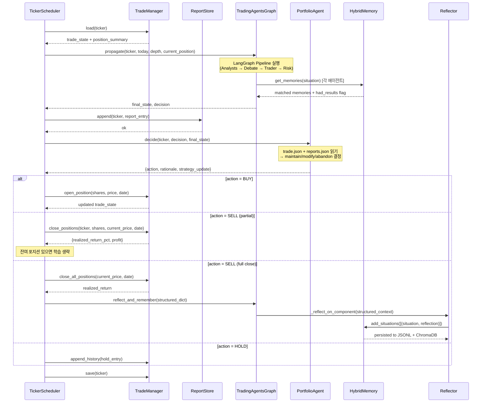
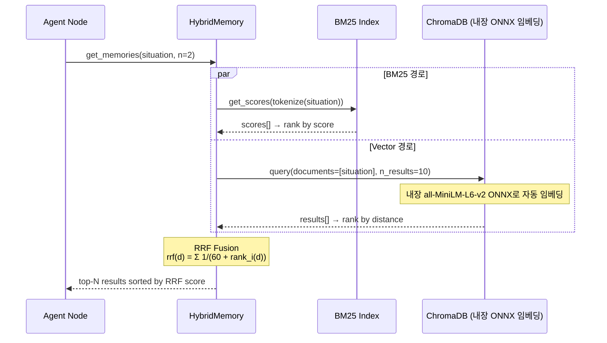

# Backend Design Doc: TradingAgents Draft Features (FR-013~019)

> Created: 2026-02-11
> Updated: 2026-02-12
> Service: tradingagents
> Type: Backend
> Requirements document: docs/tradingagents/spec.md

## 0. Summary

### Goal

기존 TradingAgents 멀티에이전트 분석 파이프라인에 **영속 메모리(Hybrid RAG)**, **가상 매매 검증**, **스케줄 기반 자동화**를 추가하여, AI 분석의 정확도를 정량적으로 추적·학습하는 자기 개선 시스템으로 진화시킨다.

### Non-goals

- 실제 증권사 API 연동 (가상 매매만)
- ~~웹 UI/대시보드 (CLI 기반 유지)~~ → **웹 API 제공 (FR-025)**
- 멀티유저/멀티전략 지원 (단일 사용자)
- 실시간 데이터 스트리밍 (분석 시점 1회성 fetch 유지)
- 에이전트 진행현황 영속화 (실시간 스트리밍만, report에는 최종 결과만 저장)

### Success metrics

- 메모리 영속성: 프로세스 재시작 후 기존 메모리 100% 복원
- 가상 매매: 티커별 trade.json에 완전한 매매 이력 기록
- 학습 효과: has_memory=true vs false 분석 결과 비교 가능
- 스케줄: 지정 주기대로 자동 분석 실행, 1시간 이내 완료

---

## 1. Scope

### In scope

- FR-015: Hybrid RAG Memory (BM25 + Vector, chromadb 내장 ONNX 임베딩)
- FR-018: 구조화된 reflect_and_remember 입력
- FR-019: Bootstrap 태깅 (has_memory 플래그)
- FR-013: 가상 매매 추적 (trade.json / reports.json)
- FR-014: Portfolio Agent (독립 에이전트, LangGraph 외부)
- FR-016: APScheduler 기반 티커별 스케줄링
- FR-017: AgentState에 current_position 추가, 에이전트 프롬프트 주입
- FR-020: 전략 기반 매매 실행 — TradeManager 부분 매도, PA 매도 수량 전략 결정
- FR-021: 분석플로우 객관성 확보 — 12에이전트에서 포지션 주입 제거 (FR-017 축소)
- FR-022: PA 프롬프트 강화 — 가중치 기반 판단, 디바이어싱, HybridMemory 연결
- FR-023: 저장 경로 통합 + 아카이빙 — close 시 trade/→archive/{TICKER}/{n}/ 이동
- FR-024: 저장 경로 개편 — memory/ 아래 experience + trade + archive 3분류 통합
- FR-025: FastAPI 웹 백엔드 — REST API + WebSocket
- FR-026: READ 공개 + WRITE 인증 (Bearer token)
- FR-027: 파일명 변경 (reports.json → report.json)
- FR-028: 저장 경로 명칭 변경 (memory/data/ → memory/experience/, virtual_trade/tickers/ → memory/trade/)
- FR-029: 기억 오염 방지 + 메타데이터 강화 — outcome/market/sector/industry 태깅, RAG 성공·실패 레이블

### Out of scope

- Pydantic 기반 설정 마이그레이션 (기존 dict 유지)
- 멀티스레드 병렬 분석 (순차 실행 유지)
- SQLite 기반 스케줄러 영속성 (인메모리 + 셀프힐링)
- Event Sourcing / CQRS 패턴 (단일 TradeManager 유지)

---

## 1.5. Tech Stack

```yaml
tech_stack:
  project_structure: "Monolith"
  be_path: "./"
  run_command: "uv run python main.py"
  language: "Python 3.10+"
  framework: "LangGraph (langgraph>=0.4.8)"
  database: "None (file-based: JSON/JSONL)"
  orm: "None (Raw JSON I/O)"
  package_manager: "uv"
  third_party:
    - "chromadb (Vector Store + Built-in ONNX Embedding)"
    - "apscheduler (Job Scheduling)"
    - "rank-bm25 (BM25 Search)"
    - "yfinance (Market Data)"
    - "langchain-core (LLM Abstraction)"
    - "fastapi (Web API Framework)"
    - "uvicorn (ASGI Server)"
  infra: "Local / WSL2 Ubuntu 22.04"
```

---

## 1.6. Dependencies

```yaml
package_manager: "uv"
project_type: "existing"

dependencies:
  # Existing (already in pyproject.toml)
  - name: "langchain-core"
    version: ">=0.3.81"
    purpose: "LLM abstraction layer"
    status: "approved"
  - name: "langgraph"
    version: ">=0.4.8"
    purpose: "Graph-based agent orchestration"
    status: "approved"
  - name: "rank-bm25"
    version: ">=0.2.2"
    purpose: "BM25 lexical search (Hybrid RAG의 BM25 경로)"
    status: "approved"
  - name: "yfinance"
    version: ">=0.2.63"
    purpose: "시장 데이터 fetch"
    status: "approved"

  # NEW — FR-015: Hybrid RAG
  - name: "chromadb"
    version: ">=1.5.0"
    purpose: "Vector store + 내장 임베딩 (all-MiniLM-L6-v2, ONNX Runtime)"
    status: "approved"

  # NEW — FR-016: Scheduling
  - name: "apscheduler"
    version: ">=3.11.2"
    purpose: "티커별 주기적 분석 스케줄링"
    status: "approved"

  # NEW — FR-025: Web API
  - name: "fastapi"
    version: ">=0.115.0"
    purpose: "REST API + WebSocket 웹 백엔드"
    status: "approved"
  - name: "uvicorn"
    version: ">=0.34.0"
    purpose: "ASGI 서버"
    status: "approved"

  # NEW — Logging
  - name: "python-json-logger"
    version: ">=3.3.0"
    purpose: "JSON 구조화 로깅 포매터"
    status: "approved"
```

---

## 2. Architecture Impact

### Components

| Service / Module                                    | Responsibility                                                                 | Change type |
| --------------------------------------------------- | ------------------------------------------------------------------------------ | ----------- |
| `tradingagents/memory/`                             | Hybrid RAG Memory (BM25+Vector via ChromaDB 내장 임베딩), 영속성, RRF 스코어링 | **new**     |
| `tradingagents/virtual_trade/`                      | 가상 매매 관리, Portfolio Agent, 리포트 저장                                   | **new**     |
| `tradingagents/scheduler/`                          | APScheduler 기반 티커별 자동 분석                                              | **new**     |
| `tradingagents/graph/trading_graph.py`              | HybridMemory 도입, 구조화 반성, position 주입                                  | modify      |
| `tradingagents/graph/reflection.py`                 | 구조화된 입력 처리, 프롬프트 확장                                              | modify      |
| `tradingagents/graph/propagation.py`                | current_position 파라미터 추가                                                 | modify      |
| `tradingagents/agents/utils/agent_states.py`        | current_position 필드 추가                                                     | modify      |
| `tradingagents/agents/managers/research_manager.py` | 포지션 컨텍스트 프롬프트 주입                                                  | modify      |
| `tradingagents/agents/trader/trader.py`             | 포지션 컨텍스트 프롬프트 주입                                                  | modify      |
| `tradingagents/agents/managers/risk_manager.py`     | 포지션 컨텍스트 프롬프트 주입                                                  | modify      |
| `tradingagents/agents/__init__.py`                  | HybridMemory 재수출 (backward compat)                                          | modify      |
| `tradingagents/default_config.py`                   | 메모리/가상매매/스케줄러 설정 추가                                             | modify      |
| `pyproject.toml`                                    | chromadb, apscheduler, fastapi, uvicorn 의존성                                 | modify      |
| `tradingagents/api/`                                | FastAPI 웹 백엔드 — REST API + WebSocket + Bearer token 인증                   | **new**     |

### Data

#### File-Based Storage Schema

이 프로젝트는 전통적 DB를 사용하지 않으며, 모든 데이터는 JSON/JSONL 파일로 영속화합니다.

```yaml
file_storage:
  # FR-015, FR-028: Hybrid RAG Memory
  memory_files:
    - path: "memory/experience/{agent_name}.jsonl"
      format: "JSONL (append-only)"
      description: "BM25 corpus — source of truth. 한 줄 = 하나의 situation+recommendation"
      schema_per_line:
        situation: "string — 시장 상황 텍스트"
        recommendation: "string — LLM 반성문/조언"
        metadata:
          ticker: "string (optional)"
          return_pct: "float (optional)"
          has_memory: "boolean (optional)"
          outcome: "string (optional) — 'win' | 'lose' (FR-029, return_pct >= 0 → win)"
          market: "string (optional) — yf.info['fullExchangeName'] e.g. 'NasdaqGS', 'KSE' (FR-029)"
          sector: "string (optional) — yf.info['sector'] e.g. 'Technology' (FR-029)"
          industry: "string (optional) — yf.info['industry'] e.g. 'Semiconductors' (FR-029)"
          created_at: "ISO 8601 timestamp"
          schema_version: "int (1)"
    - path: "memory/experience/chroma/{agent_name}/"
      format: "ChromaDB PersistentClient directory"
      description: "Vector index — derived data. JSONL에서 재구축 가능"

  # FR-013, FR-027, FR-028: Virtual Trading (경로·파일명 변경됨)
  trade_files:
    - path: "memory/trade/{TICKER}/trade.json"
      format: "JSON"
      description: "티커별 매매 상태 + 이력"
      schema:
        ticker: "string"
        initial_capital: "float (default 1000.0)"
        cash: "float"
        status: "string — open | closed"
        positions:
          - shares: "int"
            entry_price: "float"
            entry_date: "string (YYYY-MM-DD)"
        strategy:
          stop_loss: "float (nullable)"
          target: "float (nullable)"
          next_action: "string"
        history:
          - date: "string (YYYY-MM-DD)"
            analysis_no: "int"
            decision: "string — BUY | SELL | HOLD"
            action: "string"
            rationale: "string"
            cash_after: "float"
        # 청산 시 추가 필드
        closed_date: "string (nullable)"
        realized_return_pct: "float (nullable)"
        total_invested: "float (nullable)"
        total_returned: "float (nullable)"
        profit: "float (nullable)"

    - path: "memory/trade/{TICKER}/report.json"
      format: "JSON array"
      description: "분석 이력. G-ANT 파이프라인 1회 실행의 요약"
      schema_per_entry:
        date: "string (YYYY-MM-DD)"
        analysis_no: "int"
        decision: "string — BUY | SELL | HOLD"
        strategy_summary: "string"
        has_memory: "boolean"
        state_summary:
          market_report_excerpt: "string (first 500 chars)"
          final_decision_excerpt: "string (first 500 chars)"

  # FR-023: Archive (완료된 매매 사이클 보관)
  archive_files:
    - path: "memory/archive/{TICKER}/{n}/trade.json"
      format: "JSON"
      description: "완료된 매매 사이클의 trade 스냅샷 (trade_files와 동일 스키마)"
    - path: "memory/archive/{TICKER}/{n}/report.json"
      format: "JSON array"
      description: "완료된 매매 사이클의 분석 이력 스냅샷"

  # Agent name enumeration
  agent_names:
    - "bull_memory"
    - "bear_memory"
    - "trader_memory"
    - "invest_judge_memory"
    - "risk_manager_memory"
```

#### Directory Structure (Runtime)

```
memory/
├── experience/                      ← 반성문 JSONL + ChromaDB (RAG 학습)
│   ├── bull_memory.jsonl
│   ├── bear_memory.jsonl
│   ├── trader_memory.jsonl
│   ├── invest_judge_memory.jsonl
│   ├── risk_manager_memory.jsonl
│   └── chroma/
│       ├── bull_memory/
│       ├── bear_memory/
│       ├── trader_memory/
│       ├── invest_judge_memory/
│       └── risk_manager_memory/
├── trade/                           ← 활성 매매 (진행 중)
│   ├── NVDA/
│   │   ├── trade.json
│   │   └── report.json
│   └── AAPL/
│       ├── trade.json
│       └── report.json
└── archive/                         ← 완료된 매매 기록 (보관)
    └── AAPL/
        ├── 1/
        │   ├── trade.json
        │   └── report.json
        └── 2/
            ├── trade.json
            └── report.json
```

---

## 3. Code Mapping

| #      | Spec Ref      | Feature                                          | File                                                                                                                                          | Class                | Method                                                                                                                                                                | Action                                                                                                                                                                                                               | Impl              |
| ------ | ------------- | ------------------------------------------------ | --------------------------------------------------------------------------------------------------------------------------------------------- | -------------------- | --------------------------------------------------------------------------------------------------------------------------------------------------------------------- | -------------------------------------------------------------------------------------------------------------------------------------------------------------------------------------------------------------------- | ----------------- |
| 1      | FR-015        | HybridMemory 모듈 init                           | `tradingagents/memory/__init__.py`                                                                                                            | —                    | —                                                                                                                                                                     | 새 모듈 생성, `HybridMemory` 재수출                                                                                                                                                                                  | [x]               |
| 2      | FR-015        | HybridMemory 클래스                              | `tradingagents/memory/hybrid_memory.py`                                                                                                       | `HybridMemory`       | `__init__`, `add_situations`, `get_memories`, `clear`, `_load_corpus`, `_save_entry`, `_rebuild_bm25`, `_get_or_create_collection`, `_rrf_fusion`                     | 새 파일: BM25+Vector Hybrid Memory, RRF 스코어링, JSONL 영속성, ChromaDB PersistentClient                                                                                                                            | [x]               |
| 3      | FR-015        | backward compat 재수출                           | `tradingagents/agents/__init__.py`                                                                                                            | —                    | —                                                                                                                                                                     | `from tradingagents.memory.hybrid_memory import HybridMemory as FinancialSituationMemory` 로 변경                                                                                                                    | [x]               |
| 4      | FR-015        | TradingAgentsGraph 메모리 교체                   | `tradingagents/graph/trading_graph.py`                                                                                                        | `TradingAgentsGraph` | `__init__`                                                                                                                                                            | `FinancialSituationMemory` → `HybridMemory` import 변경, 5개 인스턴스 생성 시 config 전달                                                                                                                            | [x]               |
| 5      | FR-015        | 의존성 추가                                      | `pyproject.toml`                                                                                                                              | —                    | —                                                                                                                                                                     | dependencies에 `chromadb` 추가 (자체 임베딩 엔진 사용)                                                                                                                                                               | [x]               |
| 6      | FR-018        | 구조화된 반성 입력                               | `tradingagents/graph/trading_graph.py`                                                                                                        | `TradingAgentsGraph` | `reflect_and_remember`                                                                                                                                                | 시그니처 `(self, returns_losses)` 유지하되 `Union[int, float, dict]` 처리. 숫자 입력 시 `{"return_pct": value}`로 래핑                                                                                               | [x]               |
| 7      | FR-018        | Reflector 프롬프트 확장                          | `tradingagents/graph/reflection.py`                                                                                                           | `Reflector`          | `_reflect_on_component`                                                                                                                                               | 구조화된 context 블록 추가 (ticker, return_pct, holding_days 등)                                                                                                                                                     | [x]               |
| 8      | FR-018        | JSONL 메타데이터 저장                            | `tradingagents/memory/hybrid_memory.py`                                                                                                       | `HybridMemory`       | `add_situations`                                                                                                                                                      | 각 엔트리에 metadata (ticker, return_pct, has_memory, schema_version) 함께 저장                                                                                                                                      | [x]               |
| 9      | FR-019        | Bootstrap 태깅                                   | `tradingagents/graph/trading_graph.py`                                                                                                        | `TradingAgentsGraph` | `propagate`                                                                                                                                                           | 실행 후 `self._last_had_memory` 플래그 설정 (메모리 쿼리 결과 기반)                                                                                                                                                  | [x]               |
| 10     | FR-019        | 메모리 쿼리 결과 추적                            | `tradingagents/memory/hybrid_memory.py`                                                                                                       | `HybridMemory`       | `get_memories`                                                                                                                                                        | 반환값에 결과 수 포함 + `self.last_query_had_results: bool` 플래그 설정                                                                                                                                              | [x]               |
| 11     | FR-013        | TradeManager 모듈                                | `tradingagents/virtual_trade/__init__.py`                                                                                                     | —                    | —                                                                                                                                                                     | 새 모듈 생성                                                                                                                                                                                                         | [x]               |
| ~~12~~ | ~~FR-013~~    | ~~TradeManager 클래스~~                          | ~~`tradingagents/virtual_trade/trade_manager.py`~~                                                                                            | ~~`TradeManager`~~   | ~~`__init__`, `load`, `save`, `create_initial_trade`, `open_position`, `close_all_positions`, `get_position_summary`, `calculate_realized_return`, `append_history`~~ | ~~새 파일: trade.json CRUD, 원자적 쓰기 (tmp+rename)~~                                                                                                                                                               | Superseded by #25 |
| 13     | FR-013        | ReportStore 클래스                               | `tradingagents/virtual_trade/report_store.py`                                                                                                 | `ReportStore`        | `__init__`, `append`, `load`, `get_analysis_count`                                                                                                                    | 새 파일: reports.json 관리 (JSON array append)                                                                                                                                                                       | [x]               |
| ~~14~~ | ~~FR-014~~    | ~~Portfolio Agent~~                              | ~~`tradingagents/virtual_trade/portfolio_agent.py`~~                                                                                          | ~~`PortfolioAgent`~~ | ~~`__init__`, `decide`~~                                                                                                                                              | ~~새 파일: deep_think_llm 사용, maintain/modify/abandon 결정~~                                                                                                                                                       | Superseded by #26 |
| 15     | FR-016        | TickerScheduler 모듈                             | `tradingagents/scheduler/__init__.py`                                                                                                         | —                    | —                                                                                                                                                                     | 새 모듈 생성                                                                                                                                                                                                         | [x]               |
| 16     | FR-016        | TickerScheduler 클래스                           | `tradingagents/scheduler/ticker_scheduler.py`                                                                                                 | `TickerScheduler`    | `__init__`, `add_ticker`, `remove_ticker`, `start`, `stop`, `list_schedules`, `_run_analysis_cycle`, `_self_heal`                                                     | 새 파일: APScheduler BackgroundScheduler 래퍼, per-ticker IntervalTrigger                                                                                                                                            | [x]               |
| 17     | FR-016        | 의존성 추가                                      | `pyproject.toml`                                                                                                                              | —                    | —                                                                                                                                                                     | dependencies에 `apscheduler` 추가                                                                                                                                                                                    | [x]               |
| 18     | FR-017        | AgentState 필드 추가                             | `tradingagents/agents/utils/agent_states.py`                                                                                                  | `AgentState`         | —                                                                                                                                                                     | `current_position: Annotated[str, "Current virtual trading position summary"]` 추가                                                                                                                                  | [x]               |
| 19     | FR-017        | Propagator 파라미터 추가                         | `tradingagents/graph/propagation.py`                                                                                                          | `Propagator`         | `create_initial_state`                                                                                                                                                | `current_position: str = ""` 파라미터 추가, initial state dict에 포함                                                                                                                                                | [x]               |
| ~~20~~ | ~~FR-017~~    | ~~Research Manager 포지션 주입~~                 | ~~`tradingagents/agents/managers/research_manager.py`~~                                                                                       | ~~—~~                | ~~`research_manager_node`~~                                                                                                                                           | ~~프롬프트에 `state.get("current_position", "")` 주입~~ → **#28으로 대체**                                                                                                                                           | [x]               |
| ~~21~~ | ~~FR-017~~    | ~~Trader 포지션 주입~~                           | ~~`tradingagents/agents/trader/trader.py`~~                                                                                                   | ~~—~~                | ~~`trader_node`~~                                                                                                                                                     | ~~system prompt에 current_position 컨텍스트 추가~~ → **#28으로 대체**                                                                                                                                                | [x]               |
| ~~22~~ | ~~FR-017~~    | ~~Risk Manager 포지션 주입~~                     | ~~`tradingagents/agents/managers/risk_manager.py`~~                                                                                           | ~~—~~                | ~~`risk_manager_node`~~                                                                                                                                               | ~~프롬프트에 current_position 컨텍스트 추가~~ → **#28으로 대체**                                                                                                                                                     | [x]               |
| 23     | FR-017        | TradingAgentsGraph 포지션 전달                   | `tradingagents/graph/trading_graph.py`                                                                                                        | `TradingAgentsGraph` | `propagate`                                                                                                                                                           | `current_position` 파라미터 추가, Propagator에 전달                                                                                                                                                                  | [x]               |
| 24     | ALL           | DEFAULT_CONFIG 확장                              | `tradingagents/default_config.py`                                                                                                             | —                    | —                                                                                                                                                                     | memory_dir, virtual_trade_dir, default_initial_capital, schedules, scheduler_enabled 추가                                                                                                                            | [x]               |
| 25     | FR-020        | TradeManager 부분 매도                           | `tradingagents/virtual_trade/trade_manager.py`                                                                                                | `TradeManager`       | `close_positions`                                                                                                                                                     | 새 메서드: `close_positions(ticker, shares, current_price, date)` — 평균단가 기준 부분 청산. remaining_shares 반환. `close_all_positions`는 이 메서드의 래퍼로 리팩터링                                              | [x]               |
| 26     | FR-020        | PA 매도 수량 전략 결정                           | `tradingagents/virtual_trade/portfolio_agent.py`                                                                                              | `PortfolioAgent`     | `decide`, `_build_prompt`, `_parse_decision`, `_fallback_decision`                                                                                                    | `decide()` 반환값의 `shares` 필드를 BUY·SELL 공통으로 확장. 프롬프트에 전량/분할 매도 가이드 + 보유 수량 명시. `_parse_decision`: SELL shares=0 → 전량 매도 fallback. `_fallback_decision`: SELL 시 전량 매도        | [x]               |
| 27     | FR-020        | 스케줄러 부분 매도 분기                          | `tradingagents/scheduler/ticker_scheduler.py`                                                                                                 | `TickerScheduler`    | `_run_analysis_cycle_impl`                                                                                                                                            | SELL 분기: `shares > 0 and shares < total` → `close_positions()` (부분 매도, reflect 안 함), `shares >= total` → `close_all_positions()` (전량 청산 + reflect). 기존 `close_all_positions` 직접 호출을 분기로 교체   | [x]               |
| 28     | FR-021        | 12에이전트 포지션 주입 제거                      | `tradingagents/agents/managers/research_manager.py`, `tradingagents/agents/trader/trader.py`, `tradingagents/agents/managers/risk_manager.py` | —                    | `research_manager_node`, `trader_node`, `risk_manager_node`                                                                                                           | #20-22에서 추가한 current_position 프롬프트 주입 제거. `propagate()`의 current_position 파라미터는 유지 (PA에서 사용)                                                                                                | [ ]               |
| 29     | FR-022        | PA 프롬프트 강화 + 메모리 연결                   | `tradingagents/virtual_trade/portfolio_agent.py`                                                                                              | `PortfolioAgent`     | `decide`, `_build_prompt`                                                                                                                                             | 프롬프트: 분석 결과(가중치 6) > 경험(가중치 4) 기반 판단 안내 + 디바이어싱 지시. `decide()`에서 HybridMemory 검색하여 과거 매매 기억 참조                                                                            | [ ]               |
| 30     | FR-023        | 아카이빙 처리                                    | `tradingagents/virtual_trade/trade_manager.py`                                                                                                | `TradeManager`       | `archive_to_experience`                                                                                                                                               | 새 메서드: close 시 `memory/trade/{TICKER}/` 데이터를 `memory/archive/{TICKER}/{n}/`으로 이동 + trade/ 초기화. 순번(n)은 디렉터리 카운팅으로 자동 결정                                                               | [ ]               |
| 31     | FR-024,FR-028 | 저장 경로 통합·명칭 변경                         | `tradingagents/default_config.py`, `tradingagents/memory/hybrid_memory.py`, `tradingagents/virtual_trade/trade_manager.py`                    | —                    | —                                                                                                                                                                     | config: `memory_dir` → `memory/experience/`, `virtual_trade_dir` → `memory/trade/`. JSONL·ChromaDB 경로 `memory/experience/`로 이동. `reports.json` → `report.json` 변경 (FR-027)                                    | [ ]               |
| 32     | FR-025        | FastAPI 앱 초기화                                | `tradingagents/api/app.py` [NEW]                                                                                                              | —                    | `create_app`                                                                                                                                                          | FastAPI 앱 생성, 라우터 등록, CORS 설정, APScheduler 통합                                                                                                                                                            | [ ]               |
| 33     | FR-025        | API 라우트                                       | `tradingagents/api/routes.py` [NEW]                                                                                                           | —                    | schedules CRUD, trade 조회, archive 조회, positions 조회, queue 상태, health check, RAG 검색                                                                          | REST 엔드포인트: GET/POST/DELETE /schedules, GET /trade/{ticker}, GET /archive/{ticker}, GET /positions, GET /queue, GET /health, GET /search                                                                        | [ ]               |
| 34     | FR-025        | WebSocket 진행현황 스트리밍                      | `tradingagents/api/ws.py` [NEW]                                                                                                               | —                    | `analyze_ws`                                                                                                                                                          | WS /ws/analyze/{ticker}: 분석 실행 시 에이전트 상태 실시간 스트리밍 (저장 안 함)                                                                                                                                     | [ ]               |
| 35     | FR-026        | 인증 미들웨어                                    | `tradingagents/api/auth.py` [NEW]                                                                                                             | —                    | `check_admin_token`                                                                                                                                                   | POST/PUT/DELETE 요청 시 `Authorization: Bearer {ADMIN_TOKEN}` 헤더 검증. `.env`에서 ADMIN_TOKEN 로드                                                                                                                 | [ ]               |
| 36     | FR-029        | 메타데이터 태깅 (outcome/market/sector/industry) | `tradingagents/graph/trading_graph.py`                                                                                                        | `TradingAgentsGraph` | `reflect_and_remember`                                                                                                                                                | 구조체에 outcome(win/lose), market, sector, industry 자동 추가. outcome: `return_pct >= 0 → "win"`. market/sector/industry: `yf.Ticker(ticker).info`에서 fetch. crypto(`quoteType=CRYPTOCURRENCY`)는 고정값 fallback | [ ]               |
| 37     | FR-029        | RAG 검색 결과 레이블 부착                        | `tradingagents/graph/reflection.py`                                                                                                           | `Reflector`          | `_reflect_on_component`                                                                                                                                               | 메모리 검색 결과에 outcome 기반 `[✅ 성공 사례]` / `[⚠️ 실패 사례]` 레이블 프리픽스 부착. 프롬프트에 "실패 사례는 반면교사로 참고" 지시 추가                                                                         | [ ]               |
| 38     | FR-029        | JSONL 메타데이터 확장                            | `tradingagents/memory/hybrid_memory.py`                                                                                                       | `HybridMemory`       | `add_situations`                                                                                                                                                      | metadata dict에 outcome, market, sector, industry 필드 저장. `get_memories()` 반환에 metadata 포함하여 Reflector가 outcome 확인 가능                                                                                 | [ ]               |

> **Spec Ref**: spec.md의 Req ID에 대응 (1 Req ID → 복수 Code Mapping 가능)
> **Impl column**: `[ ]` = not implemented, `[x]` = implemented (build 후 업데이트)
> **삭선(~~#~~)**: Superseded — 새 # 항목이 대체. 기존 코드는 새 항목 구현 시 교체됨

---

## 4. Implementation Plan

### 📂 Required Reference Files (Must read before implementation)

| File                                                | Reference Purpose                                                    |
| --------------------------------------------------- | -------------------------------------------------------------------- |
| `tradingagents/agents/utils/memory.py`              | 기존 BM25 메모리 인터페이스 확인 — HybridMemory가 동일 API 유지 필수 |
| `tradingagents/graph/trading_graph.py`              | 메모리 초기화, propagate(), reflect_and_remember() 패턴 확인         |
| `tradingagents/graph/reflection.py`                 | Reflector 프롬프트 구조 + 5개 reflect 메서드 패턴 확인               |
| `tradingagents/agents/managers/research_manager.py` | 프롬프트 주입 패턴 확인 (포지션 컨텍스트 추가 위치)                  |
| `tradingagents/agents/trader/trader.py`             | system prompt 패턴 확인                                              |
| `tradingagents/agents/managers/risk_manager.py`     | 프롬프트 패턴 확인                                                   |
| `tradingagents/graph/propagation.py`                | create_initial_state 시그니처 확인                                   |
| `tradingagents/agents/__init__.py`                  | 재수출 패턴 확인                                                     |
| `tradingagents/default_config.py`                   | 기존 config 키 구조 확인                                             |

⚠️ **When running build skill, read above files first to understand patterns**

### Step-by-Step Implementation

1. **Step 1: HybridMemory 클래스 구현 (FR-015)**
   - `tradingagents/memory/__init__.py` 생성
   - `tradingagents/memory/hybrid_memory.py` 구현
     - BM25 경로: 기존 `memory.py`의 `_tokenize`, `_rebuild_index` 로직 그대로 복사
     - Vector 경로: `chromadb.PersistentClient` + 내장 ONNX 임베딩 (`all-MiniLM-L6-v2`)
     - RRF 스코어링: `rrf_score(d) = sum(1 / (60 + rank_i(d)))` for each retriever
     - JSONL 영속성: `add_situations()` 시 append, `__init__` 시 load + BM25 rebuild
     - Lazy init: ChromaDB는 첫 `get_memories()` 호출 시 초기화
     - Graceful degradation: ChromaDB 로드 실패 시 BM25-only 모드로 fallback (경고 로그)
   - `tradingagents/agents/__init__.py` 수정: `HybridMemory as FinancialSituationMemory` 재수출
   - `tradingagents/graph/trading_graph.py` 수정: import 변경
   - `pyproject.toml` 수정: `chromadb` 추가 (완료)

2. **Step 2: 구조화된 학습 + Bootstrap 태깅 (FR-018, FR-019)**
   - `tradingagents/graph/trading_graph.py` — `reflect_and_remember()` 시그니처 변경
     - `Union[int, float, dict]` 처리, 숫자 시 `{"return_pct": value}` 래핑
   - `tradingagents/graph/reflection.py` — 프롬프트에 구조화 context 블록 추가
   - `tradingagents/memory/hybrid_memory.py` — `add_situations()` 에 metadata 저장
   - `tradingagents/graph/trading_graph.py` — `propagate()` 후 `_last_had_memory` 플래그 설정

3. **Step 3: 가상 매매 모듈 (FR-013)**
   - `tradingagents/virtual_trade/__init__.py` 생성
   - `tradingagents/virtual_trade/trade_manager.py` 구현
     - JSON CRUD, 원자적 쓰기 (tmp + `os.replace()`), 수익률 계산
   - `tradingagents/virtual_trade/report_store.py` 구현
     - reports.json array append/read

4. **Step 4: Portfolio Agent (FR-014)**
   - `tradingagents/virtual_trade/portfolio_agent.py` 구현
     - `deep_think_llm` 사용, trade.json + reports.json 읽기
     - 프롬프트: 현재 포지션 + 최신 분석 + 과거 이력 → maintain/modify/abandon 결정
     - 수동 호출로 먼저 프롬프트 품질 검증 후 스케줄러에 연결

5. **Step 5: 스케줄러 (FR-016)**
   - `tradingagents/scheduler/__init__.py` 생성
   - `tradingagents/scheduler/ticker_scheduler.py` 구현
     - APScheduler `BackgroundScheduler` + `IntervalTrigger`
     - 스케줄 트리거 → 글로벌 `asyncio.Queue`에 push → 워커 1개가 순차 처리 (max_workers=1)
     - `_run_analysis_cycle()`: load → propagate → report → portfolio → trade → reflect
     - Per-ticker `threading.Lock` (timeout=600초)
     - Self-healing: 시작 시 config + virtual_trade/tickers/ 스캔
     - 단순 재시도: 예외 시 1회 retry, 실패 시 로깅
   - `pyproject.toml`: `apscheduler` 추가 (완료)

6. **Step 6: Position-Aware Analysis (FR-017)**
   - `tradingagents/agents/utils/agent_states.py` — `current_position: str` 추가
   - `tradingagents/graph/propagation.py` — `current_position` 파라미터 추가
   - `tradingagents/agents/managers/research_manager.py` — 프롬프트 주입
   - `tradingagents/agents/trader/trader.py` — system prompt 주입
   - `tradingagents/agents/managers/risk_manager.py` — 프롬프트 주입
   - `tradingagents/graph/trading_graph.py` — `propagate()` 에 `current_position` 파라미터

7. **Step 7: Config 업데이트**
   - `tradingagents/default_config.py` — 모든 새 설정 키 추가

8. **Step 8: 전략 기반 매매 실행 (FR-020)**
   - `tradingagents/virtual_trade/trade_manager.py` — `close_positions()` 새 메서드 추가
     - **평균단가** 기준 수익률 계산 (`avg_price = total_invested / total_shares`)
     - positions 배열에서 shares만큼 차감 (선입 순 제거, 수익률은 평균단가 기준)
     - 잔여 수량(remaining_shares) 반환
     - `close_all_positions()`를 `close_positions()` 래퍼로 리팩터링 (반환값은 기존 스키마 유지)
   - `tradingagents/virtual_trade/portfolio_agent.py` — PA 매도 수량 확장
     - `_build_prompt()`: 전량/분할 매도 가이드 명시 + 보유 수량(total_shares) 포함
     - `_parse_decision()`: SELL shares 추출 + shares=0 → 전량 매도 fallback
     - `_fallback_decision()`: SELL 시 전량 매도 (기존 shares=0 → total_shares)
     - `decide()` 반환값 shares 필드: BUY·SELL 공통
   - `tradingagents/scheduler/ticker_scheduler.py` — SELL 분기 변경
     - `shares > 0 and shares < total` → `close_positions()` (부분 매도)
     - `shares >= total` → `close_all_positions()` (전량 청산 + reflect)

9. **Step 9: PA 객관성 + Experience 아키텍처 + 기억 오염 방지 (FR-021~024, FR-029)**
   - `tradingagents/agents/managers/research_manager.py`, `trader.py`, `risk_manager.py` — 포지션 주입 제거
     - #20-22에서 추가한 current_position 프롬프트 주입 삭제
     - `propagate()`의 current_position 파라미터는 유지 (PA에서 사용)
   - `tradingagents/virtual_trade/portfolio_agent.py` — PA 프롬프트 강화
     - 분석 결과(가중치 6) > 경험(가중치 4) 기반 판단 안내
     - 디바이어싱 지시 추가 ("포지션 때문에 편향되지 마라")
     - HybridMemory에서 과거 매매 기억 검색하여 판단에 활용
   - `tradingagents/virtual_trade/trade_manager.py` — 아카이빙 + 경로 변경
     - 새 메서드 `archive_to_experience()`: close 시 `memory/trade/` → `memory/archive/` 이동
     - 디렉터리 구조: `memory/archive/{TICKER}/{n}/trade.json, report.json`
     - 순번(n)은 기존 디렉터리 카운팅으로 자동 결정
     - `memory/trade/{TICKER}/` 초기화 (다음 매매 사이클 준비)
   - `tradingagents/default_config.py` + 관련 파일들 — 경로 변경
     - `memory_dir`: `memory/data/` → `memory/experience/`
     - `virtual_trade_dir`: `virtual_trade/tickers/` → `memory/trade/`
     - 파일명: `reports.json` → `report.json`
   - `tradingagents/graph/trading_graph.py` — 메타데이터 자동 태깅 (FR-029)
     - `reflect_and_remember()`: outcome 자동 결정 (`return_pct >= 0` → `"win"`)
     - market/sector/industry를 `yfinance.Ticker(ticker).info`에서 fetch
     - `quoteType == "CRYPTOCURRENCY"` 시 sector/industry → `"Cryptocurrency"`, market → `"Crypto"` 고정값
     - fetch 실패 시 `null`로 저장, reflect는 정상 진행
   - `tradingagents/graph/reflection.py` — RAG 결과 레이블링 (FR-029)
     - `_reflect_on_component()`: 검색 결과에 `[✅ 성공 사례]` / `[⚠️ 실패 사례]` 레이블 프리픽스 부착
     - 프롬프트에 "실패 사례는 반면교사로 참고하라" 지시 추가
   - `tradingagents/memory/hybrid_memory.py` — 메타데이터 확장 (FR-029)
     - `add_situations()`: metadata에 outcome, market, sector, industry 저장
     - `get_memories()`: 반환값에 metadata 포함 (Reflector가 outcome 접근 가능)

10. **Step 10: 웹 백엔드 API (FR-025~026)**
    - `tradingagents/api/app.py` [NEW] — FastAPI 앱 초기화
      - `create_app()`: 라우터 등록, CORS, lifespan에서 APScheduler 시작
    - `tradingagents/api/routes.py` [NEW] — REST 엔드포인트
      - GET /schedules, POST /schedules, DELETE /schedules/{ticker}
      - GET /trade/{ticker}, GET /trade/{ticker}/report
      - GET /archive/{ticker}, GET /archive/{ticker}/{n}
      - GET /positions, GET /queue, GET /health, GET /search
    - `tradingagents/api/ws.py` [NEW] — WebSocket
      - WS /ws/analyze/{ticker}: 에이전트 상태 실시간 스트리밍 (report 저장 안 함)
    - `tradingagents/api/auth.py` [NEW] — 인증 미들웨어
      - POST/PUT/DELETE 요청 시 Bearer {ADMIN_TOKEN} 검증
      - `.env`에서 ADMIN_TOKEN 로드

---

## 5. Sequence Diagram

### 5.1 스케줄 기반 분석 사이클 (Full Flow)



### 5.2 HybridMemory 검색 흐름 (RRF)



---

## 6. API Specification

> 아래는 공개 Python 인터페이스 명세입니다. HTTP API 명세는 §6.6을 참조하세요.

### 6.1 HybridMemory (FR-015)

```yaml
python_api:
  - name: "HybridMemory"
    module: "tradingagents.memory.hybrid_memory"
    description: "BM25+Vector Hybrid RAG Memory with JSONL persistence"
    constructor:
      params:
        - name: "name"
          type: "str"
          required: true
          description: "메모리 인스턴스 이름 (e.g., 'bull_memory')"
        - name: "config"
          type: "dict"
          required: false
          description: "설정 dict (memory_dir 사용)"
    methods:
      - name: "add_situations"
        params:
          - name: "situations_and_advice"
            type: "List[Tuple[str, str]]"
            description: "(situation, recommendation) 쌍 리스트"
          - name: "metadata"
            type: "dict"
            required: false
            description: "저장할 메타데이터 (ticker, return_pct, has_memory, outcome, market, sector, industry, schema_version)"
        returns: "None"
        description: "BM25 corpus(JSONL) + ChromaDB에 동시 추가"
      - name: "get_memories"
        params:
          - name: "current_situation"
            type: "str"
            description: "검색 쿼리 (현재 시장 상황)"
          - name: "n_matches"
            type: "int"
            default: 1
            description: "반환할 매치 수"
        returns: "List[dict] — {matched_situation, recommendation, rrf_score, metadata}"
        description: "RRF로 BM25+Vector 결과 융합, top-N 반환"
      - name: "clear"
        returns: "None"
        description: "메모리 초기화 (JSONL + ChromaDB 모두)"
```

### 6.2 TradingAgentsGraph 변경사항 (FR-017, FR-018)

```yaml
python_api:
  - name: "TradingAgentsGraph.propagate"
    changes: "current_position 파라미터 추가"
    params:
      - name: "company_name"
        type: "str"
      - name: "trade_date"
        type: "str"
      - name: "depth"
        type: "int"
        required: false
      - name: "current_position"
        type: "str"
        default: '""'
        description: "가상 매매 포지션 요약 (e.g., 'Holding 2 shares NVDA avg $257.50')"
    returns: "Tuple[dict, str] — (final_state, decision)"

  - name: "TradingAgentsGraph.reflect_and_remember"
    changes: "Union[int, float, dict] 입력 지원"
    params:
      - name: "returns_losses"
        type: "Union[int, float, dict]"
        description: |
          숫자: backward compat — {"return_pct": value}로 래핑
          dict: 구조화된 입력
            {
              "ticker": str,
              "return_pct": float,
              "holding_days": int,
              "analysis_count": int,
              "market_condition": str,
              "has_memory": bool,
              "outcome": str,        # FR-029: "win" | "lose" (auto: return_pct >= 0 → win)
              "market": str,         # FR-029: yf.info["fullExchangeName"] e.g. "NasdaqGS"
              "sector": str,         # FR-029: yf.info["sector"] e.g. "Technology"
              "industry": str,       # FR-029: yf.info["industry"] e.g. "Semiconductors"
              "schema_version": 1
            }
    returns: "None"
```

### 6.3 TradeManager (FR-013)

```yaml
python_api:
  - name: "TradeManager"
    module: "tradingagents.virtual_trade.trade_manager"
    constructor:
      params:
        - name: "base_dir"
          type: "str"
          description: "virtual_trade/tickers/ 기본 경로"
    methods:
      - name: "load"
        params: [{ name: "ticker", type: "str" }]
        returns: "dict — trade.json 내용"
      - name: "save"
        params: [{ name: "ticker", type: "str" }]
        returns: "None"
        description: "원자적 쓰기 (tmp + os.replace)"
      - name: "create_initial_trade"
        params:
          - { name: "ticker", type: "str" }
          - { name: "initial_capital", type: "float", default: 1000.0 }
        returns: "dict — 초기 trade.json"
      - name: "open_position"
        params:
          - { name: "ticker", type: "str" }
          - { name: "shares", type: "int" }
          - { name: "price", type: "float" }
          - { name: "date", type: "str" }
        returns: "dict — updated trade state"
      - name: "close_positions"
        params:
          - { name: "ticker", type: "str" }
          - {
              name: "shares",
              type: "int",
              description: "매도 수량 (PA가 전략에 따라 결정)",
            }
          - { name: "current_price", type: "float" }
          - { name: "date", type: "str" }
        returns: "dict — {realized_return_pct, profit, remaining_shares}"
        description: "부분 매도. 평균단가 기준 수익률 계산. positions 배열에서 shares 차감"
      - name: "close_all_positions"
        params:
          - { name: "ticker", type: "str" }
          - { name: "current_price", type: "float" }
          - { name: "date", type: "str" }
        returns: "dict — {realized_return_pct, profit, total_invested, total_returned}"
        description: "전량 청산. close_positions(ticker, total_shares, price, date)와 동일"
      - name: "get_position_summary"
        params: [{ name: "ticker", type: "str" }]
        returns: "str — 포지션 요약 (e.g., 'Holding 2 shares NVDA avg $257.50')"
```

### 6.4 PortfolioAgent (FR-014)

```yaml
python_api:
  - name: "PortfolioAgent"
    module: "tradingagents.virtual_trade.portfolio_agent"
    constructor:
      params:
        - { name: "llm", type: "BaseChatModel", description: "deep_think_llm" }
        - { name: "trade_manager", type: "TradeManager" }
        - { name: "report_store", type: "ReportStore" }
    methods:
      - name: "decide"
        params:
          - { name: "ticker", type: "str" }
          - {
              name: "pipeline_decision",
              type: "str",
              description: "BUY/SELL/HOLD",
            }
          - {
              name: "pipeline_state",
              type: "dict",
              description: "propagate() 반환 final_state",
            }
          - {
              name: "current_price",
              type: "float",
              description: "yfinance 당일 종가",
            }
        returns: |
          dict — {
            "action": "BUY | SELL | HOLD | MODIFY",
            "shares": int,           # BUY 시 매수 수량, SELL 시 매도 수량 (PA가 전략 기반으로 결정)
            "rationale": str,
            "strategy_update": dict
          }
        notes: |
          매매 수량은 PortfolioAgent LLM이 결정.
          프롬프트에 현재 cash 잔고 + 현재가 + 보유 수량을 포함하여 LLM이 적정 수량 산출.
          BUY: 전략에 따라 부분 매수 (e.g., 25% 선매수, 풀백 시 50% 추가매수)
          SELL: 전략에 따라 부분 매도 (e.g., 목표가 근접 시 50% 매도, 나머지 트레일링)
          current_price: yfinance 당일 종가 — yf.Ticker(ticker).history(period="1d")["Close"].iloc[-1]
```

### 6.5 TickerScheduler (FR-016)

```yaml
python_api:
  - name: "TickerScheduler"
    module: "tradingagents.scheduler.ticker_scheduler"
    constructor:
      params:
        - { name: "graph", type: "TradingAgentsGraph" }
        - { name: "config", type: "dict" }
    methods:
      - name: "add_ticker"
        params:
          - { name: "ticker", type: "str" }
          - { name: "interval_days", type: "int", default: 4 }
          - { name: "initial_capital", type: "float", default: 1000.0 }
        returns: "None"
      - name: "remove_ticker"
        params: [{ name: "ticker", type: "str" }]
        returns: "None"
      - name: "start"
        returns: "None"
        description: "스케줄러 시작 + self-heal 스캔"
      - name: "stop"
        returns: "None"
        description: "즉시 중단 (scheduler.shutdown(wait=False)). 원자적 쓰기로 파일 안전성 보장"
      - name: "list_schedules"
        returns: "List[dict] — 활성 스케줄 목록"
```

---

## 7. Infra/Ops

### Environment Variables

| Variable                    | Description                                   | Default                           |
| --------------------------- | --------------------------------------------- | --------------------------------- |
| `LLM_PROVIDER`              | LLM 프로바이더 (`gemini-cli` / `antigravity`) | `gemini-cli`                      |
| `TRADINGAGENTS_RESULTS_DIR` | 분석 결과 저장 경로                           | `./results`                       |
| `TRADINGAGENTS_MEMORY_DIR`  | 메모리 데이터 경로 (override)                 | `<project_dir>/memory/experience` |
| `TRADINGAGENTS_TRADE_DIR`   | 가상 매매 데이터 경로 (override)              | `<project_dir>/memory/trade`      |
| `ADMIN_TOKEN`               | API 쓰기 인증 토큰 (FR-026)                   | — (필수, `.env`에서 로드)         |

### Config 추가 키 (DEFAULT_CONFIG)

```python
# Memory (FR-015, FR-028)
"memory_dir": os.path.join(PROJECT_DIR, "memory/experience"),

# Virtual Trading (FR-013, FR-028)
"virtual_trade_dir": os.path.join(PROJECT_DIR, "memory/trade"),
"default_initial_capital": 1000.0,

# Archive (FR-023)
"archive_dir": os.path.join(PROJECT_DIR, "memory/archive"),

# Scheduler (FR-016)
"schedules": [],  # List[{"ticker": str, "interval_days": int, "initial_capital": float}]
"scheduler_enabled": False,

# API (FR-025, FR-026)
"api_port": 8000,
```

### Deployment Changes

- `uv add chromadb apscheduler fastapi uvicorn[standard]` 실행 필요
- 첫 실행 시 ChromaDB가 `all-MiniLM-L6-v2` ONNX 모델 자동 다운로드 (~80MB, 1회)
- `memory/experience/`, `memory/trade/`, `memory/archive/` 디렉토리는 자동 생성 (makedirs)
- API 서버 실행: `uv run uvicorn tradingagents.api.app:app --port 8000`

---

## 8. Risks & Tradeoffs (Debate Conclusion)

### Chosen Option

- **Domain Architect 방안 채택**: 프로젝트 현실(10 티커, 단일 사용자, 4일 간격)에 맞는 실용적 설계
- **BPA에서 수용**: RRF 스코어링, JSONL 영속성, 원자적 쓰기, schema_version, 우아한 실패 처리

### Rejected Alternatives

| 제안                             | 거부 사유                                                                                  |
| -------------------------------- | ------------------------------------------------------------------------------------------ |
| Event Sourcing / CQRS (가상매매) | 1 ticker에 4일에 1회 쓰기. 4개 클래스 분리는 과도한 추상화                                 |
| Pydantic Settings                | 기존 10+파일이 `config["key"]` 패턴 사용. 전면 리팩토링 비용 > 이득                        |
| SQLiteJobStore (APScheduler)     | 스케줄은 config에 정의. 재시작 시 config에서 재생성. SQLite 불필요                         |
| TypedDict V1→V2 버저닝           | AgentState는 일시적 (propagate 동안만 존재). 영속 데이터 아님                              |
| ThreadPoolExecutor 병렬화        | TradingAgentsGraph에 공유 mutable state (curr_state, ticker 등). 스레드 안전성 미확보      |
| multiprocessing (API 분석)       | 에이전트 플로우는 I/O-bound(LLM API 대기). GIL 경합 없음. IPC/pickle 복잡성 대비 이득 없음 |
| 별도 스케줄러 프로세스           | FastAPI lifespan으로 동일 프로세스에서 APScheduler 기동 가능. IPC 불필요                   |
| Per-role LLM Config              | 현재 2-tier (deep/quick) 모델로 충분. 10+개 config 키 추가는 불필요한 복잡성               |
| Linear alpha blending (메모리)   | BM25/cosine 스코어 분포 비대칭 문제. RRF가 파라미터 프리로 우월                            |

### Reasoning

- **프로젝트 제약**: 단일 사용자, 10 티커 미만, 로컬 실행. Enterprise 패턴은 과도
- **Best Practice 수용**: RRF, JSONL, 원자적 쓰기, schema_version — 비용 대비 효과 높은 항목만 선별 채택
- **향후 개선 시점**: 멀티유저/100+ 티커 시 Pydantic 마이그레이션, 병렬화, SQLite 검토

### Assumptions

- **Confirmed**: RRF k=60 상수는 IR 문헌 표준값 (Cormack et al., 2009)
- **Confirmed**: all-MiniLM-L6-v2는 속도/품질 밸런스 최적 (~80MB, CPU 가능)
- **Confirmed**: ChromaDB PersistentClient는 HNSW 기반, 1M 문서까지 스케일
- **Estimated**: 포지션 주입이 Research Manager/Trader/Risk Manager에만 필요 (분석가는 객관성 유지). 실제 프롬프트 테스트로 검증 필요
- **Estimated**: Portfolio Agent 프롬프트 품질은 수동 테스트 후 스케줄러에 연결해야 함
- **Confirmed**: 에이전트 플로우는 I/O-bound — LLM API 대기(99%+) + 파일 I/O. GIL 경합 없으므로 스레드 안전

---

## 9. Error/Auth/Data Checklist (3 Essential Checks)

### Error Handling

| Situation                                      | Location                                  | Handling Method                                                          | Response                                                                    |
| ---------------------------------------------- | ----------------------------------------- | ------------------------------------------------------------------------ | --------------------------------------------------------------------------- |
| ChromaDB 로드 실패 (import error, 디스크 오류) | `HybridMemory.__init__`                   | try/except → BM25-only fallback + `logging.warning`                      | 메모리 기능 degraded (벡터 검색 없이 동작)                                  |
| ChromaDB ONNX 모델 다운로드 실패               | `HybridMemory._lazy_init_vector`          | try/except → BM25-only fallback + 경고                                   | 메모리 기능 degraded                                                        |
| JSONL 파일 손상 (불완전한 줄)                  | `HybridMemory._load_corpus`               | 줄 단위 파싱, 실패 줄 skip + 경고                                        | 손상 줄 제외 후 나머지 로드                                                 |
| ChromaDB 인덱스 손상                           | `HybridMemory.get_memories`               | 예외 시 BM25-only 결과 반환 + JSONL에서 chroma 재구축 예약               | 일시적 degraded                                                             |
| trade.json 쓰기 중 프로세스 종료               | `TradeManager.save`                       | 원자적 쓰기 (tmp + `os.replace()`)                                       | 기존 파일 보존 (tmp 파일만 유실)                                            |
| LLM API timeout (429/503)                      | `PortfolioAgent.decide`, 파이프라인 내부  | 기존 retry 로직 (30s → model downgrade)                                  | 재시도 후 실패 시 해당 분석 스킵 + 로깅                                     |
| PortfolioAgent LLM timeout                     | `PortfolioAgent.decide`                   | 600초 timeout (deep_think_llm)                                           | timeout 시 pipeline_decision 직접 사용 (LLM 판단 없이 BUY/SELL/HOLD 그대로) |
| 스케줄러 분석 실패                             | `TickerScheduler._run_analysis_cycle`     | 1회 재시도, 실패 시 해당 ticker만 skip + 다음 주기에 재시도              | 다른 티커 스케줄 영향 없음                                                  |
| yfinance 데이터 fetch 실패                     | `dataflows/interface.py` (기존)           | Alpha Vantage fallback (기존 동작)                                       | fallback 벤더로 자동 전환                                                   |
| yfinance 현재가 fetch 실패                     | `TickerScheduler._run_analysis_cycle`     | close_all_positions 시 당일 종가 fetch 실패 → 해당 주기 SELL skip + 로깅 | 다음 주기에 재시도                                                          |
| 잘못된 ADMIN_TOKEN                             | `tradingagents/api/auth.py`               | Bearer 헤더 불일치                                                       | 401 Unauthorized — `{"detail": "Invalid or missing token"}`                 |
| 존재하지 않는 ticker 요청                      | `tradingagents/api/routes.py`             | trade.json 미존재 시                                                     | 404 Not Found — `{"detail": "Ticker not found"}`                            |
| 큐 중복 push 시도                              | `TickerScheduler._on_schedule_trigger`    | 큐에 동일 ticker 존재 여부 확인 → 존재 시 거부 + 로깅                    | 중복 분석 방지, 해당 트리거 skip                                            |
| yfinance info fetch 실패 (FR-029)              | `TradingAgentsGraph.reflect_and_remember` | try/except → market/sector/industry를 `null`로 저장 + 경고               | reflect 정상 진행, 메타데이터만 불완전                                      |

### Authorization

| Action                      | Required Permission                   | Validation Location                | On Failure                            |
| --------------------------- | ------------------------------------- | ---------------------------------- | ------------------------------------- |
| Gemini LLM 호출             | OAuth token (`~/.gemini` credentials) | `llm_clients/gemini_cli_client.py` | 자동 token refresh, 실패 시 분석 중단 |
| 파일 시스템 쓰기            | 로컬 파일 권한                        | OS level                           | `PermissionError` → 로깅 + 작업 중단  |
| API WRITE (POST/PUT/DELETE) | `Authorization: Bearer {ADMIN_TOKEN}` | `tradingagents/api/auth.py`        | 401 Unauthorized 반환                 |
| API READ (GET)              | 없음 (공개 접근)                      | —                                  | —                                     |

> **API 보안 모델 (FR-026)**: READ 공개 + WRITE 인증. 단일 사용자 전용.
> ADMIN_TOKEN은 `.env`에서 로드, Bearer 헤더로 검증. Cloudflare Tunnel 뒤에서 운영.

### Data Integrity

| Validation Item                                  | Validation Timing                               | On Failure                                                           |
| ------------------------------------------------ | ----------------------------------------------- | -------------------------------------------------------------------- |
| trade.json 필수 필드 존재 (ticker, cash, status) | `TradeManager.load()` 시                        | KeyError → `create_initial_trade()` 로 재초기화 + 경고               |
| positions 배열 유효성 (shares > 0, price > 0)    | `TradeManager.open_position()` 시               | `ValueError` → 포지션 미개설, 로깅                                   |
| cash 잔고 충분 여부                              | `TradeManager.open_position()` 시               | `ValueError("Insufficient cash")` → 매수 거부                        |
| 보유 수량 초과 매도 방지                         | `TradeManager.close_positions()` 시             | `ValueError("Insufficient shares")` → 매도 거부, 로깅                |
| JSONL 엔트리 schema_version 확인                 | `HybridMemory._load_corpus()` 시                | 미인식 버전 → skip + 경고 (미래 호환성)                              |
| reports.json 중복 analysis_no                    | `ReportStore.append()` 시                       | 마지막 analysis_no + 1 자동 채번 (중복 방지)                         |
| 스케줄러 동시 실행 방지                          | `TickerScheduler._run_analysis_cycle()` 진입 시 | per-ticker `threading.Lock(timeout=600)` → timeout 시 해당 주기 skip |

⚠️ **이 섹션이 비어있으면 구현의 80%가 불안정해집니다** — 반드시 완성

---

## 10. Additional Design Details (from Review)

### 매매 수량 결정

- **결정**: PortfolioAgent LLM이 매수·매도 수량 모두 결정
- BUY/SELL = 방향성, 전략이 실행 디테일(수량, 타점, 비중)을 결정
- 프롬프트에 현재 cash 잔고 + 현재가 + 보유 수량 포함 → LLM이 적정 수량 산출
- `decide()` 반환 dict에 `shares: int` 필드 포함 (매수·매도 공통)

### 부분 매도 수익률 계산 (FR-020)

- **결정**: **평균단가** 방식 (FIFO 아님)
- `avg_price = total_invested / total_shares` → 전체 보유 평균 매입가
- 부분 매도 수익률: `(current_price - avg_price) / avg_price × 100`
- positions 배열: 매수 이력 추적용으로 유지, 수익률 계산에는 사용하지 않음
- 사유: 가상 매매라 세금/회계 이슈 없음, 평균단가가 직관적이고 구현 간결

### PA SELL Fallback 정책 (FR-020)

- **결정**: SELL + shares=0 → **전량 매도 fallback**
- `_parse_decision()`: SELL 시 shares=0이면 보유 전체 수량으로 대체
- `_fallback_decision()`: LLM timeout 시 SELL → 전량 매도 (shares = total_shares)
- 프롬프트에 전량/분할 매도 가이드 명시하여 shares=0 사례 최소화

### 현재가 소스

- **결정**: yfinance 당일 종가
- `yf.Ticker(ticker).history(period="1d")["Close"].iloc[-1]`
- `close_all_positions()` 및 `open_position()` 시 사용
- fetch 실패 시 해당 주기 매매 skip

### PortfolioAgent Timeout

- **결정**: 600초 (기존 LLM timeout과 동일)
- timeout 시 PortfolioAgent 판단 없이 pipeline_decision 직접 사용

### Scheduler Stop 동작

- **결정**: 즉시 중단 (`scheduler.shutdown(wait=False)`)
- 명시적 stop() 호출 = 사용자 의도 = 즉시 중단
- 원자적 쓰기로 파일 안전성 보장 (tmp + rename)

### 기억 오염 방지 메타데이터 매핑 (FR-029)

- **결정**: yfinance `Ticker(ticker).info`에서 4개 필드 자동 fetch
- **필드 매핑**:
  | metadata 키 | yfinance 소스 | 예시 (NVDA) | 예시 (005930.KS) | 예시 (BTC-USD) |
  |---|---|---|---|---|
  | `outcome` | `return_pct >= 0 → "win"` | `"win"` | `"lose"` | `"win"` |
  | `market` | `info["fullExchangeName"]` | `"NasdaqGS"` | `"KSE"` | `"Crypto"` (fallback) |
  | `sector` | `info["sector"]` | `"Technology"` | `"Technology"` | `"Cryptocurrency"` (fallback) |
  | `industry` | `info["industry"]` | `"Semiconductors"` | `"Consumer Electronics"` | `"Cryptocurrency"` (fallback) |
- **Crypto 분기**: `quoteType == "CRYPTOCURRENCY"` → sector/industry = `"Cryptocurrency"`, market = `"Crypto"`
- **Fetch 실패**: market/sector/industry → `null`, reflect는 정상 진행 (graceful degradation)
- **RAG 레이블**: 검색 결과에 outcome 기반 `[✅ 성공 사례]` / `[⚠️ 실패 사례]` 프리픽스 부착
- **프롬프트 지시**: "실패 사례는 반면교사로 참고하라"

### 이전 Check에서 이관된 항목

- **yfinance timeout**: 60초
- **LLM timeout**: 600초 일률 적용
- **Caching**: 불필요 (30일 lookback 기준 데이터 양이 적음, 1회성 분석)
- **Prompt versioning**: 현재 에이전트 파일 내 하드코딩 유지 (향후 분리 검토)

### API 설계 디테일 (FR-025~026)

- **CORS**: `*` 전체 허용 — Cloudflare Tunnel 뒤에서 운영, 추가 제한 불필요
- **POST /schedules Body**: `{"ticker": str, "interval_days": int, "initial_capital": float}` (기존 config 구조 재사용)
- **Error Response 형식**: `{"detail": str}` — FastAPI 기본 HTTPException 형식
- **Pagination**: GET /archive/{ticker} 에 offset/limit 파라미터 지원
  - Default: offset=0, limit=20, max limit=100
  - 파일 기반 구현: `sorted(os.listdir(archive_dir))[offset:offset+limit]`
- **WebSocket Message Schema**: `{"agent": str, "status": str, "message": str, "timestamp": str}`
  - agent: 현재 실행 중인 에이전트 이름
  - status: `running` | `completed` | `error`
  - message: 에이전트 출력 요약
  - timestamp: ISO 8601
- **WebSocket Timeout**: 3600초 (분석 1시간 제한과 동일)
- **서버 실행**: `uv run uvicorn tradingagents.api.app:app --port 8000`
- **분석 수동 실행 API 없음**: POST /analyze/{ticker} 제거 — 모든 분석은 스케줄 트리거로만 실행. LLM rate limit으로 병렴 실행 불가능하므로 수동 API 없이 큐로 통일
- **GET /queue Response Schema**:
  ```json
  {"running": "NVDA" | null, "pending": ["AAPL", "TSLA"], "total": 3}
  ```
- **GET /health Response Schema**:
  ```json
  {"status": "ok" | "degraded", "scheduler_running": true, "queue_length": 2, "schedules_count": 5, "uptime_seconds": 3600}
  ```
- **POST /schedules 중복 티커**: 이미 스케줄이 등록된 티커 → 409 Conflict `{"detail": "Schedule already exists for {ticker}"}`
- **DELETE /schedules/{ticker} 큐 정리**: 스케줄 삭제 시 큐에 해당 티커가 있으면 함께 제거 (drain+re-enqueue 패턴: 큐 전체 비우고 해당 티커 제외 후 나머지 다시 넣음)
- **GET /positions 현재가**: yfinance `Ticker.history(period="1d")` 실시간 조회. 티커별 `calculate_realized_return()` 호출하여 `unrealized_return_pct` 계산. fetch 실패 시 `current_price: null, unrealized_return_pct: null`
- **큐 상태 추적 구현**: `app.py`에 `current_running_ticker: Optional[str]` 전역 변수. 큐 워커가 티커 시작/완료 시 갱신. `GET /queue`는 `analysis_queue._queue` (deque 내부) 스냅샷으로 pending 읽음
- **WebSocket 스트리밍 메커니즘**:
  - `app.py`에 `ws_subscribers: Dict[str, List[asyncio.Queue]]` 구독 구조
  - `broadcast_status()` 함수: 스레드 안전 (`run_coroutine_threadsafe`). 큐 워커 + `_run_analysis_cycle_impl` 단계별 호출
  - `ticker_scheduler.py`에 `_status_callback` 속성: 큐 워커가 분석 시작 전 설정, 각 단계에서 `_notify_status()` 호출
  - WS 클라이언트: 연결 시 개인 subscriber queue 생성, 종료 시 제거
- **WebSocket Reconnection**: heartbeat 불필요 (분석 20~30분 단기 연결). 클라이언트 측 onclose 이벤트로 재연결 가이드만 제공
- **Logging**: `python-json-logger` 패키지로 JSON 구조화 로깅. 포매터만 교체, 코드 변경 없음. 향후 로그 수집 도구 연동 대비
- **pyproject.toml**: `fastapi`, `uvicorn`, `python-json-logger` 의존성 등록 필수

### 배포 및 동시성 모델 (FR-025)

- **배포**: 단일 프로세스 — `uvicorn` → FastAPI `lifespan` 이벤트로 APScheduler 자동 기동/종료
  - APScheduler는 내부적으로 자체 백그라운드 스레드를 생성. uvicorn 이벤트 루프 블로킹 없음
  - 별도 스케줄러 프로세스 불필요. 실행 명령어 단일: `uv run uvicorn tradingagents.api.app:app --port 8000`

  ```python
  # tradingagents/api/app.py
  @asynccontextmanager
  async def lifespan(app: FastAPI):
      scheduler.start()
      asyncio.create_task(_queue_worker())  # 큐 워커 시작
      yield
      scheduler.shutdown()
  app = FastAPI(lifespan=lifespan)
  ```

- **동시성**: 글로벌 in-memory 큐(`asyncio.Queue`) + 순차 실행 (max_workers=1)
  - **근거**: LLM API(특히 Gemini OAuth) rate limit으로 병렴 실행 시 429 에러 발생. 순차 실행이 유일하게 안정적
  - **흐름**: 스케줄 트리거 → 큐 push → 워커 1개가 `asyncio.to_thread()`로 순차 실행 (수동 분석 API 없음)
  - **처리량**: 분석 1회 ≈ 20~30분 → 하루 최대 ~48 티커 처리 가능
  - **GIL 이슈 없음**: 에이전트 플로우는 I/O-bound (LLM API 대기 99%+). GIL은 I/O 대기 중 자동 해제
  - **멀티프로세싱 불채택 사유**: IPC 복잡성, pickle 제약, Lock/상태 공유 불가. I/O-bound 작업에 실질적 이득 없음

  ```python
  # tradingagents/scheduler/ticker_scheduler.py
  analysis_queue: asyncio.Queue = asyncio.Queue()  # 글로벌 큐

  async def _queue_worker():
      """Worker: 큐에서 1개씩 꺼내서 순차 실행"""
      while True:
          ticker = await analysis_queue.get()
          await asyncio.to_thread(_run_analysis_cycle, ticker)
          analysis_queue.task_done()

  def _on_schedule_trigger(ticker: str):
      """스케줄 트리거 → 큐에 push"""
      analysis_queue.put_nowait(ticker)
  ```

  - **큐 중복 방지**: 동일 ticker가 큐에 이미 있으면 push 거부 + 로깅

  ```python
  def _on_schedule_trigger(ticker: str):
      if ticker in [item for item in analysis_queue._queue]:
          logger.info(f"{ticker} already in queue, skipping")
          return
      analysis_queue.put_nowait(ticker)
  ```

---

## 11. Pre-build Preparation (from Pre-build Check)

> Added: 2026-02-12 via `/pre-build` skill

### External Services Status

| Service      | Status   | Notes                                                                     |
| ------------ | -------- | ------------------------------------------------------------------------- |
| Gemini OAuth | ✅ Ready | `~/.gemini` credentials, 기존 작동 확인                                   |
| yfinance     | ✅ Ready | 무료 API, 인증 불필요                                                     |
| chromadb     | ✅ Local | 로컬 라이브러리 + 내장 ONNX 임베딩, 첫 실행 시 모델 자동 다운로드 (~80MB) |
| apscheduler  | ✅ Local | 로컬 라이브러리, 인증 불필요                                              |

### Infrastructure Status

| Component | Status | Notes                      |
| --------- | ------ | -------------------------- |
| Database  | ⬜ N/A | 파일 기반 (JSON/JSONL)     |
| Docker    | ⬜ N/A | 로컬 실행, 컨테이너 불필요 |
| Cache     | ⬜ N/A | 1회성 분석, 캐시 불필요    |

### Business Logic Definitions

| Logic                        | Formula                                                         |
| ---------------------------- | --------------------------------------------------------------- |
| RRF 스코어링                 | `rrf(d) = Σ 1/(60 + rank_i(d))` — 이미 §4에 정의                |
| 수익률 (realized_return_pct) | `(total_returned - total_invested) / total_invested × 100`      |
| total_invested               | `Σ(shares × entry_price)` for all positions                     |
| total_returned               | `Σ(shares × current_price)` for all positions                   |
| 평균단가 (avg_price)         | `total_invested / total_shares` — 부분 매도 시 수익률 계산 기준 |
| 부분 매도 수익률             | `(current_price - avg_price) / avg_price × 100`                 |

### Mock Data Status

⬜ N/A — 기존 프로젝트, yfinance 실시간 데이터 사용, 별도 mock 불필요

---

## Sync History

| Date       | Action  | Skill     | Description                                                                                                                                                                                             |
| ---------- | ------- | --------- | ------------------------------------------------------------------------------------------------------------------------------------------------------------------------------------------------------- |
| 2026-02-11 | create  | arch      | Cursor arch skill로 FR-013~019 설계 문서 생성 (24 code mappings, 7 steps)                                                                                                                               |
| 2026-02-12 | review  | check     | 설계 완성도 검증 — 8개 gap 발견, 3개 결정(매수수량/현재가/PA timeout), 5개 skip                                                                                                                         |
| 2026-02-12 | prepare | pre-build | 구현 준비 검증 — 외부서비스/인프라 all clear, 수익률 수식 확정                                                                                                                                          |
| 2026-02-12 | update  | manual    | ChromaDB 자체 임베딩 엔진으로 통일, #5/#17 완료 마킹, embedding_model config 삭제                                                                                                                       |
| 2026-02-12 | sync    | manual    | 매매 원칙 변경: 전량 청산→전략 기반 비중 조절. close_positions(부분 매도) 추가. PA에 current_price 파라미터 추가. 매매 수량 결정 확장                                                                   |
| 2026-02-12 | update  | arch      | FR-020 Code Mapping 추가 (#25-#27), #12/#14 Superseded. Implementation Plan Step 8 추가                                                                                                                 |
| 2026-02-12 | review  | check     | FR-020 gap 4개 결정: 평균단가(not FIFO), close_all_positions 반환값 유지, SELL shares=0→전량매도, PA 프롬프트 전량/분할 매도 가이드                                                                     |
| 2026-02-13 | update  | arch      | FR-021~024 Code Mapping 추가 (#28-#31), #20-#22 Superseded. Implementation Plan Step 9 추가                                                                                                             |
| 2026-02-13 | update  | reinforce | proposal_v2.md 반영: FR-023~024 경로 수정 (trade/archive), #30-31 경로 수정, #32-35 추가 (웹 API), Step 9 경로 수정 + Step 10 추가, Non-goals 수정                                                      |
| 2026-02-13 | review  | check     | FR-025~028 설계 완성도 검증 — 경로 불일치 4곳 수정, §2 Components/§7 Env/§9 Auth·Error 갱신, API 디테일 8개 결정 (CORS, pagination, WS schema, 서버 포트, 중복 방지 등)                                 |
| 2026-02-13 | update  | manual    | 배포/동시성 모델 추가: 단일 프로세스(lifespan), asyncio.to_thread(), multiprocessing 불채택 사유. §8 Rejected Alternatives + §10 API 디테일 + Assumptions 갱신                                          |
| 2026-02-13 | review  | check     | FR-029 설계 완성도 검증 — yfinance API 검증(sector/industry/fullExchangeName), 7개 gap 식별, 5개 결정(market→fullExchangeName, +industry, crypto fallback, fetch실패→null, legacy N/A). §1-§10 9곳 갱신 |
| 2026-02-13 | update  | check     | 동시성 모델 변경: asyncio.to_thread 병렴 → 글로벌 asyncio.Queue 순차 실행(max_workers=1). LLM rate limit 근거. Step 5/§10 갱신, 큐 워커 실시 코드 추가                                                  |
| 2026-02-13 | review  | check     | 전체 설계 완성도 검증 — 9개 gap: POST /analyze 제거, GET /queue·/health 추가, 큐 중복 거부, JSON logging(python-json-logger), WS heartbeat→클라이언트 reconnection, API 버저닝/rate limit skip          |
| 2026-02-13 | review  | check     | Round 2 — 5개 gap: GET /queue·/health 응답 스키마 정의, python-json-logger 의존성 추가, 큐 워커 lifespan 시작, POST /schedules 중복 409, DELETE /schedules 큐 정리                                      |
| 2026-02-13 | update  | fix       | 코드 검증 후 설계 보충 — WS 스트리밍 메커니즘(broadcast+subscriber), 큐 상태 추적(current_running_ticker), GET /positions 현재가, DELETE /schedules drain+re-enqueue, pyproject.toml 의존성 필수        |
