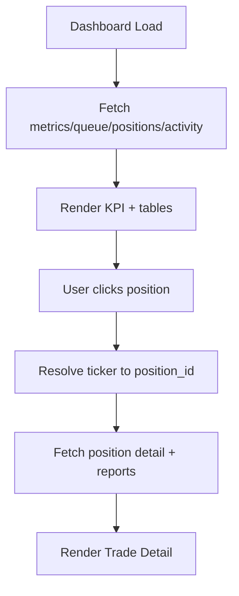

# Frontend Design Doc: TradingAgents UI (GANT)

> Created: 2026-02-15
> Service: tradingagents
> Type: Frontend
> Requirements: docs/tradingagents/spec.md
> UI Specification: docs/tradingagents/ui.md

## 0. Summary

### Goal
Build a Svelte-based SPA that mirrors the current prototype screens, integrates the existing API/WS, and supports PWA install for personal use.

### Non-goals
- No SSR or server-side routing in this phase.
- No multi-user auth or OAuth login.
- No real trading execution UI.

### Success metrics
- All prototype screens render live data from API.
- WS live feed updates within 1s of events.
- Schedule CRUD works with admin token flow.

---

## 1. Scope

### In scope
- Dashboard, Positions, Schedules, Live Analysis, Memory Search, Trade Detail, Archive, Auth.
- SPA routing + token gating for WRITE actions.
- PWA install support (manifest + service worker).

### Out of scope
- SvelteKit/SSR.
- Backend changes beyond documented API.
- Multi-user sessions or RBAC.

---

## 1.5. Tech Stack

```yaml
tech_stack:
  framework: "Svelte 4 + Vite 5"
  language: "TypeScript 5.x"
  state_management: "Svelte stores"
  styling: "Custom CSS (migrated from prototype)"
  routing: "svelte-spa-router (hash)"
  api_client: "Fetch wrapper"
  form_handling: "Native inputs + custom validation"
  build_tool: "Vite"
  testing: "Vitest (unit) / Playwright (e2e)"
  third_party:
    - "vite-plugin-pwa"
```

---

## 1.6. Dependencies

```yaml
package_manager: "npm"
project_type: "existing"

dependencies:
  - name: "svelte"
    version: "^4"
    purpose: "UI framework"
    status: "approved"

  - name: "svelte-spa-router"
    version: "^3"
    purpose: "hash-based routing"
    status: "approved"

  - name: "vite"
    version: "^5"
    purpose: "build tool"
    status: "approved"

  - name: "@sveltejs/vite-plugin-svelte"
    version: "^3"
    purpose: "Svelte + Vite integration"
    status: "approved"

  - name: "vite-plugin-pwa"
    version: "^0.20"
    purpose: "PWA manifest + service worker"
    status: "approved"
```

---

## 2. Architecture Impact

### Component Structure

```yaml
component_structure:
  pages:
    - path: "/"
      component: "DashboardPage"
      file: "src/routes/Dashboard.svelte"
      description: "System status, KPI, positions, queue, activity"
    - path: "/positions"
      component: "PositionsPage"
      file: "src/routes/Positions.svelte"
      description: "Active positions table/cards"
    - path: "/schedules"
      component: "SchedulesPage"
      file: "src/routes/Schedules.svelte"
      description: "Schedule list + CRUD modals"
    - path: "/trade/:ticker"
      component: "TradeDetailPage"
      file: "src/routes/TradeDetail.svelte"
      description: "Position detail + latest report + history"
    - path: "/archive/:ticker"
      component: "ArchivePage"
      file: "src/routes/Archive.svelte"
      description: "Ticker report archive"
    - path: "/live"
      component: "LiveAnalysisPage"
      file: "src/routes/Live.svelte"
      description: "Queue + WS live feed"
    - path: "/search"
      component: "MemorySearchPage"
      file: "src/routes/Search.svelte"
      description: "Hybrid memory search"
    - path: "/auth"
      component: "AuthPage"
      file: "src/routes/Auth.svelte"
      description: "Admin token entry (localStorage)"

  features:
    - name: "api"
      path: "src/lib/api/"
      components:
        - name: "apiClient"
          type: "container"
          description: "Fetch wrapper + auth header"
    - name: "live"
      path: "src/lib/ws/"
      components:
        - name: "liveStream"
          type: "container"
          description: "WS connect/reconnect + event routing"

  shared:
    - name: "AppHeader"
      path: "src/components/AppHeader.svelte"
      props:
        - name: "currentRoute"
          type: "string"
          required: true
      description: "Top nav + logo"
    - name: "BottomNav"
      path: "src/components/BottomNav.svelte"
      props:
        - name: "currentRoute"
          type: "string"
          required: true
      description: "Mobile bottom nav"
```

### File Structure

```
src/
├── routes/
│   ├── Dashboard.svelte
│   ├── Positions.svelte
│   ├── Schedules.svelte
│   ├── TradeDetail.svelte
│   ├── Archive.svelte
│   ├── Live.svelte
│   ├── Search.svelte
│   └── Auth.svelte
├── components/
│   ├── AppHeader.svelte
│   ├── BottomNav.svelte
│   ├── Modals.svelte
│   └── Cards.svelte
├── lib/
│   ├── api/
│   │   ├── client.ts
│   │   └── endpoints.ts
│   ├── ws/
│   │   └── liveStream.ts
│   └── utils/
├── stores/
│   ├── auth.ts
│   ├── ui.ts
│   └── data.ts
├── styles/
│   ├── base.css
│   └── tokens.css
├── App.svelte
└── main.ts
```

---

## 3. State Management

```yaml
state_management:
  global_state:
    - name: "authStore"
      file: "src/stores/auth.ts"
      state:
        - field: "token"
          type: "string | null"
          initial: "localStorage.gant_admin_token || null"
      actions:
        - name: "setToken"
          description: "Persist token to localStorage"
        - name: "clearToken"
          description: "Remove token + reset auth"

    - name: "uiStore"
      file: "src/stores/ui.ts"
      state:
        - field: "currentRoute"
          type: "string"
          initial: "/"
        - field: "liveTicker"
          type: "string | null"
          initial: null

  server_state:
    - query_key: "dashboard"
      endpoint: "GET /metrics, /queue, /positions/market, /activity"
      stale_time: "30s"
      cache_time: "0"
    - query_key: "positions"
      endpoint: "GET /positions/market"
      stale_time: "30s"
      cache_time: "0"
    - query_key: "schedules"
      endpoint: "GET /schedules"
      stale_time: "30s"
      cache_time: "0"

  local_state:
    - component: "AddScheduleModal"
      states:
        - name: "tickerInput"
          type: "string"
          purpose: "New schedule ticker"
        - name: "intervalDays"
          type: "number"
          purpose: "New schedule interval"
    - component: "AuthPage"
      states:
        - name: "tokenInput"
          type: "string"
          purpose: "Admin token entry"
```

---

## 4. Route Definition

```yaml
routes:
  - path: "/"
    component: "DashboardPage"
    auth_required: false

  - path: "/positions"
    component: "PositionsPage"
    auth_required: false

  - path: "/schedules"
    component: "SchedulesPage"
    auth_required: false

  - path: "/trade/:ticker"
    component: "TradeDetailPage"
    params:
      - name: "ticker"
        type: "string"
    auth_required: false

  - path: "/archive/:ticker"
    component: "ArchivePage"
    params:
      - name: "ticker"
        type: "string"
    auth_required: false

  - path: "/live"
    component: "LiveAnalysisPage"
    auth_required: false

  - path: "/search"
    component: "MemorySearchPage"
    auth_required: false

  - path: "/auth"
    component: "AuthPage"
    auth_required: false

  - path: "*"
    component: "NotFoundRedirect"
    auth_required: false
```

---

## 5. API Integration

### API Client Configuration

```yaml
api_client:
  base_url: "${VITE_API_BASE_URL || http://localhost:8000}"
  timeout: 30000
  headers:
    - name: "Content-Type"
      value: "application/json"
  interceptors:
    request:
      - "addAuthToken (if token exists)"
    response:
      - "handleUnauthorized (clear token + redirect to /auth)"
```

### API Endpoints (Reference from arch-be.md)

```yaml
api_integration:
  - endpoint: "GET /metrics"
    hook: "fetchMetrics"
    file: "src/lib/api/endpoints.ts"

  - endpoint: "GET /positions/market"
    hook: "fetchPositionsMarket"
    file: "src/lib/api/endpoints.ts"

  - endpoint: "GET /queue"
    hook: "fetchQueue"
    file: "src/lib/api/endpoints.ts"

  - endpoint: "GET /activity"
    hook: "fetchActivity"
    file: "src/lib/api/endpoints.ts"

  - endpoint: "GET /schedules"
    hook: "fetchSchedules"
    file: "src/lib/api/endpoints.ts"

  - endpoint: "POST /schedules"
    hook: "createSchedule"
    file: "src/lib/api/endpoints.ts"
    invalidates:
      - "schedules"
      - "queue"

  - endpoint: "DELETE /schedules/{ticker}"
    hook: "deleteSchedule"
    file: "src/lib/api/endpoints.ts"
    invalidates:
      - "schedules"
      - "queue"

  - endpoint: "GET /reports?ticker={ticker}"
    hook: "fetchReportsByTicker"
    file: "src/lib/api/endpoints.ts"

  - endpoint: "GET /positions/{id}"
    hook: "fetchPositionDetail"
    file: "src/lib/api/endpoints.ts"

  - endpoint: "GET /search?query={query}"
    hook: "searchMemories"
    file: "src/lib/api/endpoints.ts"

  - endpoint: "WS /ws/analyze/{ticker}"
    hook: "connectLiveStream"
    file: "src/lib/ws/liveStream.ts"
```

---

## 6. Code Mapping

| # | Spec Ref | Feature | File | Component/Hook | Props/Params | Action | Impl |
|---|----------|---------|------|----------------|--------------|--------|------|
| 1 | FR-025 | SPA routing | src/App.svelte | Router | routes | Map routes to pages | [ ] |
| 2 | FR-034 | Dashboard metrics | src/routes/Dashboard.svelte | fetchMetrics | — | Render KPI cards | [ ] |
| 3 | FR-025 | Queue status | src/routes/Dashboard.svelte | fetchQueue | — | Render queue cards | [ ] |
| 4 | FR-013 | Positions market view | src/routes/Positions.svelte | fetchPositionsMarket | — | Render positions table/cards | [ ] |
| 5 | FR-025 | Schedules list | src/routes/Schedules.svelte | fetchSchedules | — | Render schedule cards | [ ] |
| 6 | FR-026 | Schedule create/delete auth | src/routes/Schedules.svelte | createSchedule/deleteSchedule | token | Inject Bearer token | [ ] |
| 7 | FR-025 | Live analysis stream | src/routes/Live.svelte | connectLiveStream | ticker | WS connect + render steps | [ ] |
| 8 | FR-015 | Memory search | src/routes/Search.svelte | searchMemories | query | Render RAG results | [ ] |
| 9 | FR-013 | Trade detail | src/routes/TradeDetail.svelte | fetchPositionDetail | position_id | Render trades + reports | [ ] |
| 10 | FR-032 | Archive report list | src/routes/Archive.svelte | fetchReportsByTicker | ticker | Render archive cards | [ ] |
| 11 | FR-025 | Activity feed | src/routes/Dashboard.svelte | fetchActivity | — | Render recent activity | [ ] |
| 12 | FR-026 | Admin token auth page | src/routes/Auth.svelte | AuthPage | token | Persist token + redirect | [ ] |
| 13 | FR-025 | PWA setup | public/manifest.webmanifest | — | — | Installable PWA + SW | [ ] |

---

## 7. Implementation Plan

### Required Reference Files (Must read before implementation)

| File | Reference Purpose |
|------|------------------|
| docs/tradingagents/prototype/index.html | Screen layout + copy |
| docs/tradingagents/prototype/styles.css | Tokens + styles |
| docs/tradingagents/prototype/app.js | Router + modal behaviors |

### Step-by-Step Implementation

1. **Scaffold Svelte app**
   - Vite + Svelte template
   - Add TypeScript + vite-plugin-pwa

2. **Base layout + styles**
   - Port tokens + base CSS to `src/styles`
   - Build AppHeader/BottomNav components

3. **API client + stores**
   - Implement `client.ts` with token injection
   - Add auth/ui stores with localStorage sync

4. **Routes + pages**
   - Implement page components per ui.md
   - Add NotFound redirect

5. **Schedules CRUD**
   - Form validation + error handling
   - Token redirect on 401

6. **Live analysis**
   - WS connect/reconnect
   - Step/phase rendering

7. **PWA**
   - Add manifest + icons
   - Configure SW cache strategy

---

## 8. User Flow Diagram

### Dashboard → Trade Detail



---

## 9. Style Guide

### Design Tokens

```yaml
design_tokens:
  colors:
    primary: "#6366f1"
    gain: "#059669"
    loss: "#e11d48"
    info: "#2563eb"
    warn: "#d97706"
    bg: "#f8f9fb"

  spacing:
    unit: "4px"
    scale: [1, 2, 4, 6, 8, 12, 16]

  typography:
    font_family: "Inter"
    sizes:
      xs: "0.6875rem"
      sm: "0.8125rem"
      base: "0.875rem"
      lg: "1rem"
      xl: "1.25rem"

  breakpoints:
    sm: "640px"
    md: "768px"
    lg: "1024px"
    xl: "1280px"
```

### Component Styling Convention

```yaml
styling_convention:
  approach: "Custom CSS"
  naming: "component-scoped classes"
  responsive: "mobile-first"
  dark_mode: "not supported"
```

---

## 10. Risks & Tradeoffs (Debate Conclusion)

### Chosen Option
- Svelte + Vite SPA for fast local development and minimal overhead.

### Rejected Alternatives
- SvelteKit/SSR due to unnecessary complexity for an authenticated dashboard.

### Reasoning
- Project constraints: personal dashboard with local backend.
- Best practice adoption: typed API client + localStorage token sync.
- Future improvement points: migrate to SvelteKit if public marketing pages are needed.

### Assumptions
- **Confirmed**: Backend API surface is stable and matches ui.md endpoints.
- **Confirmed**: Auth token stored in localStorage for persistent sessions.

---

## 11. UX/Performance/A11y Checklist (3 Essential Checks)

### UX States

| State | Component | Handling | User Feedback |
|-------|-----------|----------|---------------|
| Loading | Dashboard | Skeleton cards | "Loading..." |
| Empty | Positions | Empty state + CTA | "No active positions" |
| Error | Schedules | Inline error + retry | "Failed to load schedules" |

### Performance

| Item | Target | Measurement | Optimization |
|------|--------|-------------|--------------|
| LCP | < 2.5s | Lighthouse | Preload fonts, minimize blocking JS |
| Bundle size | < 250KB | Build output | Lazy-load routes |
| Re-renders | Minimal | DevTools | Use derived stores + keyed blocks |

### Accessibility

| Item | Requirement | Implementation |
|------|-------------|----------------|
| Keyboard nav | All interactive elements | Focus styles + tab order |
| Screen reader | Semantic HTML + ARIA | aria-label for buttons/modals |
| Color contrast | WCAG AA | Use existing token palette |
| Focus visible | Clear focus indicator | CSS focus-visible styles |

---

## 12. Additional Design Details (from Review)

### Auth & Token
- Token storage: `localStorage.gant_admin_token`
- On 401: clear token + redirect to `/auth`
- Token entry page: `/auth` with return redirect

### Forms & Validation
- Schedule create:
  - `ticker`: A–Z, 1–10 chars
  - `interval_days`: 1–365 integer
- Errors: inline + toast
- Submit: disable button + spinner

### Routing
- Unknown routes redirect to `/` with one-time toast

### API UI States
- All pages provide loading/empty/error states
- Retry button on network failure

### Responsive
- Touch target >= 44px
- Tables collapse to cards under 640px

### PWA
- `manifest.webmanifest`: name, short_name, icons, start_url, display=standalone
- `sw.js`: static assets precache, API network-first, fallback to cached shell
- Update: autoUpdate on new SW
