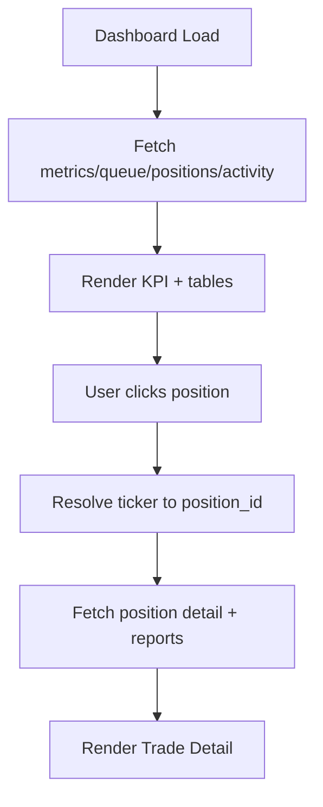

# Frontend Design Doc: TradingAgents UI (GANT)

> Created: 2026-02-15
> Service: tradingagents
> Type: Frontend
> Requirements: docs/tradingagents/spec.md
> UI Specification: docs/tradingagents/ui.md

## 0. Summary

### Goal
Deliver a responsive, API-driven dashboard UI that visualizes trading schedules, positions, live analysis, and memory search in a single-page experience aligned to the current prototype.

### Non-goals
- No backend changes beyond documented API surface.
- No production-grade auth or multi-user management (single admin token only).
- No real trading execution or order placement UI.

### Success metrics
- All prototype screens render with live API data.
- Live Analysis updates within 1s of WS events.
- Schedule CRUD succeeds with token flow and error handling.

---

## 1. Scope

### In scope
- Dashboard, Positions, Schedules, Live Analysis, Memory Search, Trade Detail, Archive screens.
- Hash-based routing and navigation.
- API wiring for all required endpoints including WS.
- PWA support (manifest + service worker) for installable UI.

### Out of scope
- Full SPA framework migration (React/Vue) in this phase.
- Server-side rendering.
- Multi-user auth, RBAC, or OAuth login.

---

## 1.5. Tech Stack

```yaml
tech_stack:
  framework: "Vanilla JS (hash-router)"
  language: "JavaScript (ES2020)"
  state_management: "Lightweight in-memory store"
  styling: "Custom CSS (docs/tradingagents/prototype/styles.css)"
  routing: "Hash-based routing (app.js)"
  api_client: "Fetch API"
  form_handling: "Native form inputs"
  build_tool: "None (static assets)"
  testing: "TBD"
  third_party: []
```

---

## 1.6. Dependencies

```yaml
package_manager: "none (static)"
project_type: "existing"

dependencies:
  - name: "fetch"
    version: "browser built-in"
    purpose: "REST API calls"
    status: "approved"

  - name: "WebSocket"
    version: "browser built-in"
    purpose: "Live analysis streaming"
    status: "approved"
```

---

## 2. Architecture Impact

### Component Structure

```yaml
component_structure:
  pages:
    - path: "/"
      component: "DashboardPage"
      file: "docs/tradingagents/prototype/index.html#page-dashboard"
      description: "System status, KPI, positions, queue, activity"
    - path: "/positions"
      component: "PositionsPage"
      file: "docs/tradingagents/prototype/index.html#page-positions"
      description: "Active positions table/cards"
    - path: "/schedules"
      component: "SchedulesPage"
      file: "docs/tradingagents/prototype/index.html#page-schedules"
      description: "Schedule list + CRUD modals"
    - path: "/trade/:ticker"
      component: "TradeDetailPage"
      file: "docs/tradingagents/prototype/index.html#page-trade"
      description: "Position detail + latest report + history"
    - path: "/archive/:ticker"
      component: "ArchivePage"
      file: "docs/tradingagents/prototype/index.html#page-archive"
      description: "Ticker report archive"
    - path: "/live"
      component: "LiveAnalysisPage"
      file: "docs/tradingagents/prototype/index.html#page-live"
      description: "Queue + WS live feed"
    - path: "/search"
      component: "MemorySearchPage"
      file: "docs/tradingagents/prototype/index.html#page-search"
      description: "Hybrid memory search"
    - path: "/auth"
      component: "AuthPage"
      file: "docs/tradingagents/prototype/index.html#page-auth"
      description: "Admin token entry (localStorage)"

  features:
    - name: "api"
      path: "docs/tradingagents/prototype/app.js"
      components:
        - name: "ApiClient"
          type: "container"
          description: "Fetch wrappers + auth header"
    - name: "live"
      path: "docs/tradingagents/prototype/app.js"
      components:
        - name: "LiveStream"
          type: "container"
          description: "WebSocket connect/reconnect + event routing"

  shared:
    - name: "AppHeader"
      path: "docs/tradingagents/prototype/index.html"
      props:
        - name: "currentRoute"
          type: "string"
          required: true
      description: "Top nav + logo"
    - name: "BottomNav"
      path: "docs/tradingagents/prototype/index.html"
      props:
        - name: "currentRoute"
          type: "string"
          required: true
      description: "Mobile bottom nav"
```

### File Structure

```
docs/tradingagents/prototype/
├── index.html              # Page containers + modals
├── styles.css              # Design tokens + layout
└── app.js                  # Router, UI events, API wiring (to be extended)
```

---

## 3. State Management

```yaml
state_management:
  global_state:
    - name: "uiState"
      file: "docs/tradingagents/prototype/app.js"
      state:
        - field: "currentRoute"
          type: "string"
          initial: "/"
        - field: "adminToken"
          type: "string | null"
          initial: "localStorage.gant_admin_token || null"
        - field: "liveTicker"
          type: "string | null"
          initial: null
      actions:
        - name: "setRoute"
          description: "Update active page"
        - name: "setToken"
          description: "Persist admin token to localStorage for write calls"
        - name: "setLiveTicker"
          description: "Bind WS stream to ticker"

  server_state:
    - query_key: "dashboard"
      endpoint: "GET /metrics, /queue, /positions/market, /activity"
      stale_time: "30s"
      cache_time: "0"
    - query_key: "positions"
      endpoint: "GET /positions/market"
      stale_time: "30s"
      cache_time: "0"
    - query_key: "schedules"
      endpoint: "GET /schedules"
      stale_time: "30s"
      cache_time: "0"

  local_state:
    - component: "AddScheduleModal"
      states:
        - name: "tickerInput"
          type: "string"
          purpose: "New schedule ticker"
        - name: "intervalDays"
          type: "number"
          purpose: "New schedule interval"
    - component: "AuthPage"
      states:
        - name: "tokenInput"
          type: "string"
          purpose: "Admin token entry"
```

---

## 4. Route Definition

```yaml
routes:
  - path: "/"
    component: "DashboardPage"
    auth_required: false

  - path: "/positions"
    component: "PositionsPage"
    auth_required: false

  - path: "/schedules"
    component: "SchedulesPage"
    auth_required: false

  - path: "/trade/:ticker"
    component: "TradeDetailPage"
    params:
      - name: "ticker"
        type: "string"
    auth_required: false

  - path: "/archive/:ticker"
    component: "ArchivePage"
    params:
      - name: "ticker"
        type: "string"
    auth_required: false

  - path: "/live"
    component: "LiveAnalysisPage"
    auth_required: false

  - path: "/search"
    component: "MemorySearchPage"
    auth_required: false

  - path: "/auth"
    component: "AuthPage"
    auth_required: false
```

---

## 5. API Integration

### API Client Configuration

```yaml
api_client:
  base_url: "{API_BASE_URL}"
  timeout: 30000
  headers:
    - name: "Content-Type"
      value: "application/json"
  interceptors:
    request:
      - "addAuthToken (if adminToken exists)"
    response:
      - "handleUnauthorized (clear token + redirect to /auth)"
```

### API Endpoints (Reference from arch-be.md)

```yaml
api_integration:
  - endpoint: "GET /metrics"
    hook: "fetchMetrics"
    file: "docs/tradingagents/prototype/app.js"
    options:
      stale_time: "30s"

  - endpoint: "GET /positions/market"
    hook: "fetchPositionsMarket"
    file: "docs/tradingagents/prototype/app.js"

  - endpoint: "GET /queue"
    hook: "fetchQueue"
    file: "docs/tradingagents/prototype/app.js"

  - endpoint: "GET /activity"
    hook: "fetchActivity"
    file: "docs/tradingagents/prototype/app.js"

  - endpoint: "GET /schedules"
    hook: "fetchSchedules"
    file: "docs/tradingagents/prototype/app.js"

  - endpoint: "POST /schedules"
    hook: "createSchedule"
    file: "docs/tradingagents/prototype/app.js"
    invalidates:
      - "schedules"
      - "queue"

  - endpoint: "DELETE /schedules/{ticker}"
    hook: "deleteSchedule"
    file: "docs/tradingagents/prototype/app.js"
    invalidates:
      - "schedules"
      - "queue"

  - endpoint: "GET /reports?ticker={ticker}"
    hook: "fetchReportsByTicker"
    file: "docs/tradingagents/prototype/app.js"

  - endpoint: "GET /positions/{id}"
    hook: "fetchPositionDetail"
    file: "docs/tradingagents/prototype/app.js"

  - endpoint: "GET /search?query={query}"
    hook: "searchMemories"
    file: "docs/tradingagents/prototype/app.js"

  - endpoint: "WS /ws/analyze/{ticker}"
    hook: "connectLiveStream"
    file: "docs/tradingagents/prototype/app.js"
```

---

## 6. Code Mapping

| # | Spec Ref | Feature | File | Component/Hook | Props/Params | Action | Impl |
|---|----------|---------|------|----------------|--------------|--------|------|
| 1 | FR-025 | Hash router + page switching | docs/tradingagents/prototype/app.js | navigate() | route, param | Map routes to page sections | [ ] |
| 2 | FR-034 | Dashboard metrics | docs/tradingagents/prototype/app.js | fetchMetrics() | — | Render KPI cards | [ ] |
| 3 | FR-025 | Queue status | docs/tradingagents/prototype/app.js | fetchQueue() | — | Render queue cards | [ ] |
| 4 | FR-013 | Positions market view | docs/tradingagents/prototype/app.js | fetchPositionsMarket() | — | Render positions table/cards | [ ] |
| 5 | FR-025 | Schedules list | docs/tradingagents/prototype/app.js | fetchSchedules() | — | Render schedule cards | [ ] |
| 6 | FR-026 | Schedule create/delete auth | docs/tradingagents/prototype/app.js | createSchedule(), deleteSchedule() | token | Inject Bearer token | [ ] |
| 7 | FR-025 | Live analysis stream | docs/tradingagents/prototype/app.js | connectLiveStream() | ticker | WS connect + render steps | [ ] |
| 8 | FR-015 | Memory search | docs/tradingagents/prototype/app.js | searchMemories() | query | Render RAG results | [ ] |
| 9 | FR-013 | Trade detail | docs/tradingagents/prototype/app.js | fetchPositionDetail() | position_id | Render trades + reports | [ ] |
| 10 | FR-032 | Archive report list | docs/tradingagents/prototype/app.js | fetchReportsByTicker() | ticker | Render archive cards | [ ] |
| 11 | FR-025 | Activity feed | docs/tradingagents/prototype/app.js | fetchActivity() | — | Render recent activity | [ ] |
| 12 | FR-026 | Admin token auth page | docs/tradingagents/prototype/app.js | AuthPage | token | Persist token + redirect | [ ] |

---

## 7. Implementation Plan

### Required Reference Files (Must read before implementation)

| File | Reference Purpose |
|------|------------------|
| docs/tradingagents/prototype/index.html | Page sections + DOM ids |
| docs/tradingagents/prototype/styles.css | Design tokens + class names |
| docs/tradingagents/prototype/app.js | Existing router + modal behaviors |

### Step-by-Step Implementation

1. **Step 1: API client helpers**
   - Add base URL config + token injection
   - Add error handler to surface 401 for token modal

2. **Step 2: Dashboard data wiring**
   - Fetch metrics, queue, activity, positions/market in parallel
   - Map responses into KPI cards + tables

3. **Step 3: Schedules CRUD**
   - Wire add/delete modals to API
   - Refresh schedules and queue on success

4. **Step 4: Trade detail + archive**
   - Resolve ticker → position_id
   - Render reports + trade history

5. **Step 5: Live analysis**
   - Connect WS to running ticker
   - Render step/phase updates and status icons

6. **Step 6: Memory search**
   - Bind search input to `/search`
   - Render outcome labels + RRF scores

7. **Step 7: PWA enablement**
   - Add `manifest.webmanifest` + icons
   - Add `sw.js` for static asset caching (network-first for API)

---

## 8. User Flow Diagram

### Dashboard → Trade Detail



---

## 9. Style Guide

### Design Tokens

```yaml
design_tokens:
  colors:
    primary: "#6366f1"
    gain: "#059669"
    loss: "#e11d48"
    info: "#2563eb"
    warn: "#d97706"
    bg: "#f8f9fb"

  spacing:
    unit: "4px"
    scale: [1, 2, 4, 6, 8, 12, 16]

  typography:
    font_family: "Inter"
    sizes:
      xs: "0.6875rem"
      sm: "0.8125rem"
      base: "0.875rem"
      lg: "1rem"
      xl: "1.25rem"

  breakpoints:
    sm: "640px"
    md: "768px"
    lg: "1024px"
    xl: "1280px"
```

### Component Styling Convention

```yaml
styling_convention:
  approach: "Custom CSS"
  naming: "component-scoped classes"
  responsive: "mobile-first"
  dark_mode: "not supported"
```

---

## 10. Risks & Tradeoffs (Debate Conclusion)

### Chosen Option
- Keep a lightweight static frontend (HTML/CSS/JS) to match existing prototype and reduce integration cost.

### Rejected Alternatives
- Full SPA framework migration (React/Vue) in this phase due to schedule and refactor cost.

### Reasoning
- Project constraints: no existing frontend stack, prototype already matches UI requirements.
- Best practice adoption: add minimal API abstraction and WS handling without full framework.
- Future improvement points: migrate to Vite + TypeScript when UI expands.

### Assumptions
- **Confirmed**: Backend API surface is stable and matches ui.md endpoints.
- **Estimated**: Single-user token handling is sufficient for initial UI.

---

## 11. UX/Performance/A11y Checklist (3 Essential Checks)

### UX States

| State | Component | Handling | User Feedback |
|-------|-----------|----------|---------------|
| Loading | Dashboard | Skeleton cards | "Loading metrics..." |
| Empty | Positions | Empty state + CTA | "No active positions" |
| Error | Schedules | Inline error + retry | "Failed to load schedules" |

### Performance

| Item | Target | Measurement | Optimization |
|------|--------|-------------|--------------|
| LCP | < 2.5s | Lighthouse | Minimize blocking JS, preload fonts |
| Bundle size | < 100KB | Build output | Keep static assets, no framework |
| Re-renders | Minimal | DevTools | Update only affected DOM nodes |

### Accessibility

| Item | Requirement | Implementation |
|------|-------------|----------------|
| Keyboard nav | All interactive elements | Tab order preserved, buttons focusable |
| Screen reader | Semantic HTML + ARIA | Use role and aria-label on modals |
| Color contrast | WCAG AA | Use existing token palette |
| Focus visible | Clear focus indicator | Use outline styles in CSS |
