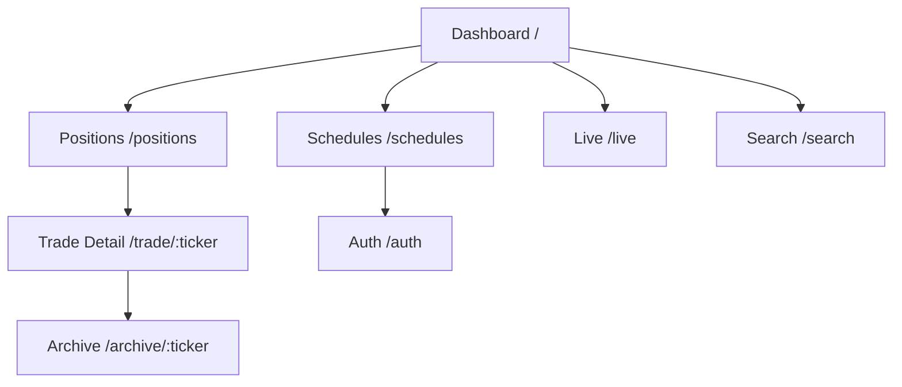

# UI Specification: TradingAgents (GANT)

> Created: 2026-02-13
> Updated: 2026-02-15
> Service: tradingagents
> Platform: responsive
> Prototype: docs/tradingagents/prototype/
> Requirements: docs/tradingagents/spec.md
> Backend API: docs/tradingagents/arch-be.md

## 0. Responsive Strategy

```yaml
platform: "responsive"
breakpoints:
  mobile: "< 640px"
  tablet: "640-1024px"
  desktop: "> 1024px"
approach: "Mobile First"
```

---

## 1. Screen List

| #   | Screen        | Route              | Related Endpoints                                                                                                  | Auth Required    | Spec Reference         |
| --- | ------------- | ------------------ | ------------------------------------------------------------------------------------------------------------------ | ---------------- | ---------------------- |
| 1   | Dashboard     | `/`                | `GET /health`, `GET /queue`, `GET /positions/market`, `GET /metrics`, `GET /activity`                              | No               | FR-025, FR-034         |
| 2   | Positions     | `/positions`       | `GET /positions/market`, `GET /metrics`                                                                            | No               | FR-013, FR-025, FR-034 |
| 3   | Schedules     | `/schedules`       | `GET /schedules`, `GET /queue`, `GET /schedules/{ticker}/cycles`, `POST /schedules`, `DELETE /schedules/{ticker}` | POST/DELETE: Yes | FR-016, FR-025, FR-026 |
| 4   | Trade Detail  | `/trade/:ticker`   | `GET /positions?status=active`, `GET /positions/{id}`, `GET /reports?ticker=`                                      | No               | FR-013, FR-014, FR-020 |
| 5   | Archive       | `/archive/:ticker` | `GET /reports?ticker=`                                                                                             | No               | FR-025, FR-032         |
| 6   | Live Analysis | `/live`            | `WS /ws/analyze/{ticker}`, `GET /queue`                                                                            | No               | FR-025                 |
| 7   | Memory Search | `/search`          | `GET /search?query={query}`                                                                                        | No               | FR-015, FR-025         |
| 8   | Auth          | `/auth`            | —                                                                                                                  | No               | FR-026                 |

---

## 2. Screen Specifications

> Prototype note: `docs/tradingagents/prototype/app.js` currently wires routing, tabs, and modals only. API wiring below is the intended data source for production.

### 2.1 Dashboard (`/`)

**Purpose**: 시스템 상태, 핵심 KPI, 활성 포지션, 큐 상태, 최근 활동을 한 화면에 요약.

**UI Components**:

```
Mobile (< 640px)
┌─────────────────────────────┐
│ GANT                        │
│ System OK                   │
├─────────────────────────────┤
│ KPI cards (3)               │
│ Active Positions (table)    │
│ Queue                       │
│ Recent Activity             │
└─────────────────────────────┘

Desktop (> 1024px)
┌──────────────────────────────────────────────────────────────────────┐
│ GANT        [Dashboard] [Positions] [Schedules] [Live] [Search]      │
├──────────────────────────────────────────────────────────────────────┤
│ KPI cards (3)                                                       │
│ Active Positions (left) | Queue + Activity (right)                  │
└──────────────────────────────────────────────────────────────────────┘
```

**Component Hierarchy**:

```yaml
DashboardPage:
  - AppHeader:
      - Logo: "GANT"
      - Navigation: [Dashboard, Positions, Schedules, Live, Search]
  - StatusBadge: System OK
  - MetricCardGrid (3 cards):
      - TotalPnlCard
      - PositionsCard (active + win/loss)
      - SchedulesCard (count + uptime)
  - DashboardGrid:
      - ActivePositionsCard (table)
      - QueueCard
      - RecentActivityCard
```

**States**:

| State   | UI Behavior                                                       |
| ------- | ----------------------------------------------------------------- |
| loading | KPI 카드 + Positions/Queue/Activity skeleton                      |
| empty   | KPI 카드 표시 + Positions "No active positions"                   |
| error   | 상단 Status 배지 "degraded" + retry 배너                          |
| loaded  | KPI 3개 + Positions/Queue/Activity 렌더링                          |

**User Interactions**:

| #   | Action               | Trigger  | API Call (intended)                                                                 | Result                           |
| --- | -------------------- | -------- | ---------------------------------------------------------------------------------- | -------------------------------- |
| 1   | Load dashboard       | Load     | `GET /health`, `GET /queue`, `GET /positions/market`, `GET /metrics`, `GET /activity` | KPI + cards 렌더링               |
| 2   | View positions       | Click    | —                                                                                  | Route → `/positions`             |
| 3   | Open trade detail    | Row click| —                                                                                  | Route → `/trade/{ticker}`        |
| 4   | Live view            | Click    | —                                                                                  | Route → `/live`                  |

---

### 2.2 Positions (`/positions`)

**Purpose**: 활성 포지션의 현재가·미실현 수익률 표시. 클릭 시 Trade Detail로 이동.

**UI Components**:

```
Mobile: 카드 리스트
Desktop: 테이블 (Ticker / Shares / Avg Cost / Current / P&L / Return)
```

**Component Hierarchy**:

```yaml
PositionsPage:
  - AppHeader
  - PnlBanner (from /metrics)
  - PositionList:
      - PositionCard (mobile) / PositionRow (desktop)
```

**States**:

| State   | UI Behavior                                                                                  |
| ------- | -------------------------------------------------------------------------------------------- |
| loading | Skeleton rows/cards                                                                          |
| empty   | EmptyState: "No active positions. Add a schedule to start trading."                          |
| error   | ErrorMessage + retry                                                                          |
| loaded  | 리스트 렌더링, current_price null 시 "Price unavailable" 표시                                |

**User Interactions**:

| #   | Action            | Trigger | API Call (intended)                           | Result                        |
| --- | ----------------- | ------- | -------------------------------------------- | ----------------------------- |
| 1   | Load positions    | Load    | `GET /positions/market`, `GET /metrics`       | 리스트 + Total P&L 렌더링     |
| 2   | View trade detail | Click   | —                                            | Route → `/trade/{ticker}`     |

---

### 2.3 Schedules (`/schedules`)

**Purpose**: 분석 스케줄 CRUD. 티커 추가/삭제 + 상태 표시. WRITE는 Bearer token 필요.

**UI Components**:

```
Schedule cards with ticker, interval, next run, last run, status badge
Add Schedule modal (ticker + interval)
Delete confirm modal
Token modal for write operations
```

**Component Hierarchy**:

```yaml
SchedulesPage:
  - AppHeader
  - PageHeader:
      - AddButton
  - ScheduleList:
      - ScheduleCard (repeat)
  - AddScheduleModal
  - DeleteConfirmModal
  - TokenModal
```

**States**:

| State        | UI Behavior                                                                                     |
| ------------ | ----------------------------------------------------------------------------------------------- |
| loading      | Skeleton cards                                                                                  |
| empty        | EmptyState + Add CTA                                                                            |
| error        | ErrorMessage + retry                                                                            |
| loaded       | 스케줄 카드 목록 렌더링                                                                         |
| submitting   | Submit/Delete 버튼 disabled                                                                     |
| conflict_409 | Add 모달에 inline error                                                                          |

**User Interactions**:

| #   | Action              | Trigger              | API Call (intended)                                              | Result                       |
| --- | ------------------- | -------------------- | ----------------------------------------------------------------- | ---------------------------- |
| 1   | Load schedules      | Load                 | `GET /schedules`, `GET /queue`, `GET /schedules/{ticker}/cycles` | 카드 상태/last run 렌더링   |
| 2   | Create schedule     | Submit add modal     | `POST /schedules` (Bearer)                                       | 목록 갱신                    |
| 3   | Delete schedule     | Confirm delete modal | `DELETE /schedules/{ticker}` (Bearer)                            | 목록 갱신                    |

---

### 2.4 Trade Detail (`/trade/:ticker`)

**Purpose**: 특정 티커의 포지션 상태, 최신 리포트, 히스토리 표시.

**UI Components**:

```
Summary card (shares / avg cost / current / P&L)
Tabs: Latest Report / History
Archive link
```

**Component Hierarchy**:

```yaml
TradeDetailPage:
  - AppHeader
  - PageHeader (Back, Title, PnL badge)
  - PositionSummaryCard
  - TabBar: [Latest Report, History]
  - TabContent:
      - LatestReport
      - HistoryList
  - ArchiveLink
```

**Data Resolution (intended)**:

1. `GET /positions?status=active` → ticker match to find position_id
2. If not active, `GET /positions?status=closed` → latest closed position_id for ticker
3. `GET /positions/{id}` → trades + reports
4. `GET /reports?ticker=` → for summary cards/cycle numbers

**User Interactions**:

| #   | Action            | Trigger | API Call (intended)                   | Result                              |
| --- | ----------------- | ------- | ------------------------------------ | ----------------------------------- |
| 1   | Load trade detail | Load    | `GET /positions`, `GET /positions/{id}`, `GET /reports?ticker=` | 상세 렌더링                        |
| 2   | Switch tab        | Click   | —                                    | 탭 전환                             |
| 3   | View archive      | Click   | —                                    | Route → `/archive/{ticker}`         |

---

### 2.5 Archive (`/archive/:ticker`)

**Purpose**: 티커별 과거 분석 리포트 목록을 카드 형태로 표시.

**UI Components**:

```
Archive cards with cycle badge, decision badge, date, short summary
Pagination controls
```

**Component Hierarchy**:

```yaml
ArchivePage:
  - AppHeader
  - PageHeader (Back, Title)
  - ArchiveList:
      - ArchiveCard (repeat)
  - Pagination
```

**User Interactions**:

| #   | Action            | Trigger | API Call (intended)     | Result                |
| --- | ----------------- | ------- | ----------------------- | --------------------- |
| 1   | Load archive list | Load    | `GET /reports?ticker=`  | 리포트 목록 렌더링    |

---

### 2.6 Live Analysis (`/live`)

**Purpose**: WebSocket으로 에이전트 실행 상태를 실시간 스트리밍.

**UI Components**:

```
Left: Queue
Right: Agent pipeline feed (phase groups + steps)
```

**Component Hierarchy**:

```yaml
LiveAnalysisPage:
  - AppHeader
  - PageHeader
  - LiveLayout:
      - QueueCard
      - AgentPipelineCard:
          - PhaseGroup (repeat)
          - AgentStep (repeat)
```

**States**:

| State        | UI Behavior                                                       |
| ------------ | ----------------------------------------------------------------- |
| loading      | Queue skeleton + "Connecting..."                                 |
| idle         | "Waiting for analysis to start"                                  |
| connected    | WS live indicator + step updates                                   |
| disconnected | Reconnect banner + auto retry                                      |

**User Interactions**:

| #   | Action        | Trigger | API Call (intended)                          | Result              |
| --- | ------------- | ------- | ------------------------------------------- | ------------------- |
| 1   | Load queue    | Load    | `GET /queue`                                 | 큐 렌더링           |
| 2   | Connect WS    | Load    | `WS /ws/analyze/{running_ticker}`            | 실시간 스트림 시작  |

---

### 2.7 Memory Search (`/search`)

**Purpose**: 과거 반성 데이터를 검색하고 성공/실패 라벨과 함께 표시.

**UI Components**:

```
Search input + button
Result cards with outcome badge, ticker, RRF score, return_pct, situation, recommendation
```

**Component Hierarchy**:

```yaml
MemorySearchPage:
  - AppHeader
  - PageHeader
  - SearchForm
  - ResultsList
```

**User Interactions**:

| #   | Action  | Trigger | API Call (intended)                | Result        |
| --- | ------- | ------- | --------------------------------- | ------------- |
| 1   | Search  | Submit  | `GET /search?query={query}`       | 결과 렌더링   |

---

### 2.8 Auth (`/auth`)

**Purpose**: WRITE 작업을 위한 Admin 토큰 입력 화면. 성공 시 localStorage에 저장하고 이전 화면으로 복귀.

**UI Components**:

```
Token input + Save button + Cancel
```

**Component Hierarchy**:

```yaml
AuthPage:
  - AppHeader
  - PageHeader: "Admin Authentication"
  - TokenForm:
      - TokenInput (password type)
      - SaveButton
      - CancelButton
```

**States**:

| State   | UI Behavior                                |
| ------- | ------------------------------------------ |
| initial | 입력 폼 표시                                |
| error   | "Invalid token" inline 메시지 + toast     |
| saved   | localStorage 저장 + 이전 페이지로 복귀     |

**User Interactions**:

| #   | Action       | Trigger      | API Call | Result                                  |
| --- | ------------ | ------------ | -------- | --------------------------------------- |
| 1   | Save token   | Click [Save] | —        | localStorage 저장 후 원래 화면으로 복귀 |
| 2   | Cancel       | Click [Cancel] | —      | 이전 화면으로 복귀                      |

---

## 3. Shared Components

| Component       | Props                               | Usage                                         |
| --------------- | ----------------------------------- | --------------------------------------------- |
| AppHeader       | currentRoute                        | All pages                                     |
| BottomNav       | currentRoute                        | Mobile nav                                    |
| DrawerMenu      | isOpen, onClose                     | Hidden fallback nav                           |
| MetricCard      | label, value, subText, tone         | Dashboard KPI row                             |
| StatusBadge     | status: `ok` \| `warn` \| `error`     | Dashboard header                              |
| TickerBadge     | ticker: string                      | Positions, Schedules, Trade, Archive, Search  |
| DecisionBadge   | decision: `BUY` \| `SELL` \| `HOLD` | Trade History, Latest Report                  |
| ReturnPctBadge  | value: float                        | Positions, Archive                            |
| OutcomeBadge    | outcome: `win` \| `loss` \| null     | Memory Search                                 |
| ActivityItem    | title, timestamp, type              | Dashboard Recent Activity                     |
| ConfirmModal    | title, message, onConfirm, onCancel | Schedules (delete), Token prompt              |
| TabBar          | tabs[], activeTab, onTabChange      | Trade Detail                                   |
| LiveIndicator   | —                                   | Live Analysis                                  |

---

## 4. Design System Reference

```yaml
ui_library: "Custom HTML/CSS"
font: "Inter"
color_scheme: "Light Breeze"
layout:
  container: "max-width 1280px"
  grid: "card-grid + dashboard-grid"
colors:
  primary: "#6366f1"
  gain: "#059669"
  loss: "#e11d48"
  info: "#2563eb"
  warn: "#d97706"
  bg: "#f8f9fb"
```

---

## 5. Navigation Flow



---

## 6. Auth Flow

```yaml
auth_model: "Bearer token (single user)"
read_endpoints: "public"
write_endpoints: "Authorization: Bearer {ADMIN_TOKEN}"
token_entry: "/auth page"
token_storage: "localStorage (gant_admin_token)"
on_401: "clear token + redirect to /auth"
```

---

## 7. Next Steps

> Wire API calls in `docs/tradingagents/prototype/app.js` and replace static data with live responses.
