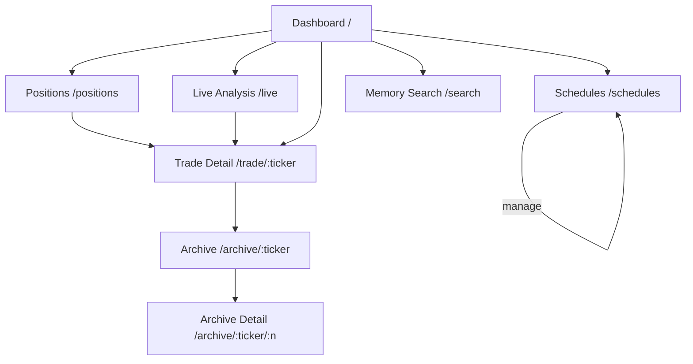

# UI Specification: TradingAgents (G-ANT Trader)

> Created: 2026-02-13
> Service: tradingagents
> Platform: responsive
> Requirements: docs/tradingagents/spec.md
> Backend API: docs/tradingagents/arch-be.md

## 0. Responsive Strategy

```yaml
platform: "responsive"
breakpoints:
  mobile: "< 640px"
  tablet: "640-1024px"
  desktop: "> 1024px"
approach: "Mobile First"
```

---

## 1. Screen List

| #   | Screen        | Route              | Related Endpoints                                                 | Auth Required    | Spec Reference         |
| --- | ------------- | ------------------ | ----------------------------------------------------------------- | ---------------- | ---------------------- |
| 1   | Dashboard     | `/`                | `GET /health`, `GET /queue`, `GET /positions`                     | No               | FR-025                 |
| 2   | Positions     | `/positions`       | `GET /positions`                                                  | No               | FR-013, FR-025         |
| 3   | Schedules     | `/schedules`       | `GET /schedules`, `POST /schedules`, `DELETE /schedules/{ticker}` | POST/DELETE: Yes | FR-016, FR-025, FR-026 |
| 4   | Trade Detail  | `/trade/:ticker`   | `GET /trade/{ticker}`, `GET /trade/{ticker}/report`               | No               | FR-013, FR-014, FR-020 |
| 5   | Archive       | `/archive/:ticker` | `GET /archive/{ticker}`, `GET /archive/{ticker}/{n}`              | No               | FR-023, FR-025         |
| 6   | Live Analysis | `/live`            | `WS /ws/analyze/{ticker}`, `GET /queue`                           | No               | FR-025                 |
| 7   | Memory Search | `/search`          | `GET /search`                                                     | No               | FR-015, FR-025         |

---

## 2. Screen Specifications

### 2.1 Dashboard (`/`)

**Purpose**: 시스템 전체 상태를 한눈에 파악하는 랜딩 페이지. Health, 큐 진행현황, 활성 포지션 요약을 카드형으로 표시.

**UI Components**:

```
Mobile (< 640px)
┌─────────────────────────────┐
│ G-ANT Trader          [☰]  │
├─────────────────────────────┤
│ ┌─────────────────────────┐ │
│ │ System Health           │ │
│ │ ● OK    Uptime: 3h 24m │ │
│ │ Scheduler: Running      │ │
│ │ Schedules: 5  Queue: 2  │ │
│ └─────────────────────────┘ │
│ ┌─────────────────────────┐ │
│ │ Queue Status            │ │
│ │ ▶ Running: NVDA         │ │
│ │ ⏳ Pending: AAPL, TSLA  │ │
│ │ Total: 3                │ │
│ └─────────────────────────┘ │
│ ┌─────────────────────────┐ │
│ │ Active Positions    [→] │ │
│ │ NVDA  2sh  +15.7%  ▲   │ │
│ │ AAPL  1sh   -3.2%  ▼   │ │
│ │ TSLA  3sh   +8.1%  ▲   │ │
│ └─────────────────────────┘ │
│                             │
│ [Schedules] [Positions]     │
│ [Live Analysis] [Search]    │
└─────────────────────────────┘

Desktop (> 1024px)
┌──────────────────────────────────────────────────────────────────────┐
│ G-ANT Trader      [Dashboard] [Positions] [Schedules] [Live] [Search]│
├──────────────────────────────────────────────────────────────────────┤
│ ┌──────────────┐ ┌──────────────┐ ┌──────────────────────────────┐  │
│ │ System Health│ │ Queue Status │ │ Active Positions             │  │
│ │ ● OK         │ │ ▶ NVDA       │ │ NVDA  2sh  $285  +15.7% ▲   │  │
│ │ Uptime: 3h   │ │ ⏳ AAPL      │ │ AAPL  1sh  $178   -3.2% ▼   │  │
│ │ Scheduler: ✓ │ │ ⏳ TSLA      │ │ TSLA  3sh  $245   +8.1% ▲   │  │
│ │ Schedules: 5 │ │ Total: 3     │ │                    [View All]│  │
│ │ Queue: 2     │ │              │ │                              │  │
│ └──────────────┘ └──────────────┘ └──────────────────────────────┘  │
└──────────────────────────────────────────────────────────────────────┘
```

**Component Hierarchy**:

```yaml
DashboardPage:
  - AppHeader:
      - Logo: "G-ANT Trader"
      - Navigation: [Dashboard, Positions, Schedules, Live, Search]
      - MobileMenuButton (< 640px only)
  - StatusCardGrid:
      - HealthCard:
          - StatusIndicator (ok | degraded)
          - UptimeLabel
          - SchedulerStatus
          - CountBadges: [schedules_count, queue_length]
      - QueueCard:
          - RunningTickerLabel
          - PendingList
          - TotalCount
      - PositionsSummaryCard:
          - PositionRow (repeat):
              - TickerBadge
              - SharesCount
              - CurrentPrice
              - ReturnPctBadge (green ▲ / red ▼)
          - ViewAllLink → /positions
  - QuickNavGrid (mobile only):
      - NavButton: [Schedules, Positions, Live Analysis, Search]
```

**States**:

| State   | UI Behavior                                                           |
| ------- | --------------------------------------------------------------------- |
| loading | 3개 카드 영역에 skeleton shimmer                                      |
| empty   | HealthCard 표시 + PositionsCard "No active positions" + QuickNav 표시 |
| error   | HealthCard "degraded" 표시 + 하단 retry 배너                          |
| loaded  | 카드 3개 + 데이터 렌더링                                              |

**User Interactions**:

| #   | Action                   | Trigger                                   | API Call                                                 | Result                    |
| --- | ------------------------ | ----------------------------------------- | -------------------------------------------------------- | ------------------------- |
| 1   | View dashboard           | Page load                                 | `GET /health`, `GET /queue`, `GET /positions` (parallel) | 3개 카드 렌더링           |
| 2   | Navigate to positions    | Click Position row or "View All"          | —                                                        | Route → `/positions`      |
| 3   | Navigate to trade detail | Click ticker badge                        | —                                                        | Route → `/trade/{ticker}` |
| 4   | Navigate to live         | Click queue running ticker                | —                                                        | Route → `/live`           |
| 5   | Refresh                  | Pull-to-refresh (mobile) / Refresh button | 3 endpoints 재호출                                       | 데이터 갱신               |

---

### 2.2 Positions (`/positions`)

**Purpose**: 모든 활성 포지션을 현재가·미실현 수익률과 함께 표시. 포지션 클릭 시 Trade Detail로 이동.

**UI Components**:

```
Mobile (< 640px)
┌─────────────────────────────┐
│ ← Positions                 │
├─────────────────────────────┤
│ Total P&L: +$127.30 (+8.5%)│
├─────────────────────────────┤
│ ┌─────────────────────────┐ │
│ │ NVDA            +15.7%▲ │ │
│ │ 2 shares @ avg $247.50  │ │
│ │ Current: $285.00        │ │
│ │ P&L: +$75.00            │ │
│ └─────────────────────────┘ │
│ ┌─────────────────────────┐ │
│ │ AAPL             -3.2%▼ │ │
│ │ 1 share @ avg $184.00   │ │
│ │ Current: $178.11        │ │
│ │ P&L: -$5.89             │ │
│ └─────────────────────────┘ │
│ ┌─────────────────────────┐ │
│ │ TSLA             +8.1%▲ │ │
│ │ 3 shares @ avg $226.67  │ │
│ │ Current: $245.00        │ │
│ │ P&L: +$55.00            │ │
│ └─────────────────────────┘ │
└─────────────────────────────┘

Desktop (> 1024px)
┌──────────────────────────────────────────────────────────────────────┐
│ Positions                                    Total P&L: +$127.30   │
├──────────┬────────┬──────────┬──────────┬───────────┬───────────────┤
│ Ticker   │ Shares │ Avg Cost │ Current  │ P&L ($)   │ Return (%)    │
├──────────┼────────┼──────────┼──────────┼───────────┼───────────────┤
│ NVDA     │ 2      │ $247.50  │ $285.00  │ +$75.00   │  +15.7% ▲    │
│ AAPL     │ 1      │ $184.00  │ $178.11  │ -$5.89    │   -3.2% ▼    │
│ TSLA     │ 3      │ $226.67  │ $245.00  │ +$55.00   │   +8.1% ▲    │
└──────────┴────────┴──────────┴──────────┴───────────┴───────────────┘
```

**Component Hierarchy**:

```yaml
PositionsPage:
  - AppHeader
  - TotalPnlBanner:
      - TotalPnlAmount (color-coded)
      - TotalReturnPct (color-coded)
  - PositionList:
      - PositionCard (mobile) / PositionRow (desktop) (repeat):
          - TickerBadge
          - SharesCount
          - AvgCostPrice
          - CurrentPrice
          - PnlAmount (green/red)
          - ReturnPctBadge (green ▲ / red ▼)
  - EmptyState (when no positions)
```

**States**:

| State   | UI Behavior                                                                                  |
| ------- | -------------------------------------------------------------------------------------------- |
| loading | Skeleton rows / cards (3~5개)                                                                |
| empty   | EmptyState: "No active positions. Add a schedule to start trading." + [Go to Schedules] 버튼 |
| error   | ErrorMessage + retry 버튼                                                                    |
| loaded  | 포지션 카드/행 렌더링, 현재가 null 시 "Price unavailable" 표시                               |

**User Interactions**:

| #   | Action            | Trigger                        | API Call         | Result                    |
| --- | ----------------- | ------------------------------ | ---------------- | ------------------------- |
| 1   | Load positions    | Page load                      | `GET /positions` | 포지션 목록 렌더링        |
| 2   | View trade detail | Click position card/row        | —                | Route → `/trade/{ticker}` |
| 3   | Refresh prices    | Pull-to-refresh / Refresh 버튼 | `GET /positions` | 현재가·수익률 갱신        |

---

### 2.3 Schedules (`/schedules`)

**Purpose**: 분석 스케줄 CRUD. 티커 추가/삭제 + 활성 스케줄 목록 조회. WRITE 작업은 Bearer token 인증 필요.

**UI Components**:

```
Mobile (< 640px)
┌─────────────────────────────┐
│ ← Schedules          [＋]  │
├─────────────────────────────┤
│ ┌─────────────────────────┐ │
│ │ NVDA         Every 4d   │ │
│ │ Capital: $1,000         │ │
│ │ Next: 2026-02-15 09:00  │ │
│ │                  [🗑️]   │ │
│ └─────────────────────────┘ │
│ ┌─────────────────────────┐ │
│ │ AAPL         Every 4d   │ │
│ │ Capital: $1,000         │ │
│ │ Next: 2026-02-16 09:00  │ │
│ │                  [🗑️]   │ │
│ └─────────────────────────┘ │
│ ┌─────────────────────────┐ │
│ │ TSLA         Every 7d   │ │
│ │ Capital: $2,000         │ │
│ │ Next: 2026-02-18 09:00  │ │
│ │                  [🗑️]   │ │
│ └─────────────────────────┘ │
└─────────────────────────────┘

── Add Schedule Modal ────────
┌─────────────────────────────┐
│ Add Schedule          [✕]  │
├─────────────────────────────┤
│ Ticker                      │
│ ┌─────────────────────────┐ │
│ │ e.g. NVDA               │ │
│ └─────────────────────────┘ │
│ Interval (days)             │
│ ┌─────────────────────────┐ │
│ │ 4                       │ │
│ └─────────────────────────┘ │
│ Initial Capital ($)         │
│ ┌─────────────────────────┐ │
│ │ 1000                    │ │
│ └─────────────────────────┘ │
│                             │
│ [Cancel]       [Add]        │
└─────────────────────────────┘

── Delete Confirmation Modal ─
┌─────────────────────────────┐
│ Delete Schedule       [✕]  │
├─────────────────────────────┤
│ Remove schedule for NVDA?   │
│ This will also remove the   │
│ ticker from the queue.      │
│                             │
│ [Cancel]     [Delete]       │
└─────────────────────────────┘
```

**Component Hierarchy**:

```yaml
SchedulesPage:
  - AppHeader
  - PageHeader:
      - Title: "Schedules"
      - AddButton: [＋]
  - ScheduleList:
      - ScheduleCard (repeat):
          - TickerBadge
          - IntervalLabel (e.g., "Every 4d")
          - CapitalLabel
          - NextRunLabel
          - DeleteButton [🗑️]
  - EmptyState (when no schedules)
  - AddScheduleModal:
      - TickerInput (text, required, uppercase)
      - IntervalInput (number, default: 4, min: 1)
      - CapitalInput (number, default: 1000, min: 100)
      - CancelButton
      - SubmitButton
  - DeleteConfirmModal:
      - ConfirmMessage
      - CancelButton
      - DeleteButton (destructive style)
```

**States**:

| State        | UI Behavior                                                                                     |
| ------------ | ----------------------------------------------------------------------------------------------- |
| loading      | Skeleton cards (3개)                                                                            |
| empty        | EmptyState: "No schedules configured. Add your first ticker to begin." + [＋ Add Schedule] 버튼 |
| error        | ErrorMessage + retry                                                                            |
| loaded       | 스케줄 카드 목록 렌더링                                                                         |
| modal:add    | Add Schedule 모달 오버레이                                                                      |
| modal:delete | Delete Confirm 모달 오버레이                                                                    |
| submitting   | Submit/Delete 버튼 spinner + disabled                                                           |
| conflict_409 | Add 모달에 inline error: "Schedule already exists for {ticker}"                                 |

**User Interactions**:

| #   | Action              | Trigger                 | API Call                                    | Result                                           |
| --- | ------------------- | ----------------------- | ------------------------------------------- | ------------------------------------------------ |
| 1   | Load schedules      | Page load               | `GET /schedules`                            | 스케줄 목록 렌더링                               |
| 2   | Open add modal      | Click [＋]              | —                                           | AddScheduleModal 표시                            |
| 3   | Submit schedule     | Click [Add] in modal    | `POST /schedules` (Bearer token)            | 성공 → 모달 닫기 + 목록 갱신, 409 → inline error |
| 4   | Open delete confirm | Click [🗑️]              | —                                           | DeleteConfirmModal 표시                          |
| 5   | Confirm delete      | Click [Delete] in modal | `DELETE /schedules/{ticker}` (Bearer token) | 목록에서 제거 + 큐 정리                          |

---

### 2.4 Trade Detail (`/trade/:ticker`)

**Purpose**: 특정 티커의 현재 매매 상태, 전략, 매매 이력, 분석 리포트를 상세 표시.

**UI Components**:

```
Mobile (< 640px)
┌─────────────────────────────┐
│ ← NVDA Trade                │
├─────────────────────────────┤
│ ┌─────────────────────────┐ │
│ │ Position Summary        │ │
│ │ Status: 🟢 Open         │ │
│ │ Cash: $485.00           │ │
│ │ Shares: 2 @ avg $257.50 │ │
│ │ Invested: $515.00       │ │
│ └─────────────────────────┘ │
│ ┌─────────────────────────┐ │
│ │ Current Strategy        │ │
│ │ Stop Loss: $260.00      │ │
│ │ Target: $300.00         │ │
│ │ Next: 풀백 시 $264에서   │ │
│ │       50% 추가매수       │ │
│ └─────────────────────────┘ │
│                             │
│ [Trade History] [Reports]   │
│ ─── Tab: Trade History ──── │
│ ┌─────────────────────────┐ │
│ │ #3  2026-02-10  HOLD    │ │
│ │ 관망. 목표가 접근 대기   │ │
│ │ Cash: $485.00           │ │
│ ├─────────────────────────┤ │
│ │ #2  2026-02-06  BUY     │ │
│ │ 풀백 추가매수 $265 x 1  │ │
│ │ Cash: $485.00           │ │
│ ├─────────────────────────┤ │
│ │ #1  2026-02-02  BUY     │ │
│ │ 첫 진입. $250 x 1       │ │
│ │ Cash: $750.00           │ │
│ └─────────────────────────┘ │
└─────────────────────────────┘

Desktop (> 1024px)
┌──────────────────────────────────────────────────────────────────────┐
│ ← NVDA Trade                                                        │
├──────────────────────────────────┬───────────────────────────────────┤
│ Position Summary                 │ Current Strategy                  │
│ Status: 🟢 Open                  │ Stop Loss: $260.00               │
│ Cash: $485.00 / $1,000           │ Target: $300.00                  │
│ Shares: 2 @ avg $257.50         │ Next: 풀백 시 $264-266에서        │
│ Total Invested: $515.00          │       50% 추가매수               │
├──────────────────────────────────┴───────────────────────────────────┤
│ [Trade History]  [Analysis Reports]                                  │
├──────────────────────────────────────────────────────────────────────┤
│ #  │ Date       │ Decision │ Action                │ Cash After     │
│ 3  │ 2026-02-10 │ HOLD     │ 관망. 목표가 접근 대기│ $485.00        │
│ 2  │ 2026-02-06 │ BUY      │ 풀백 추가매수 $265x1  │ $485.00        │
│ 1  │ 2026-02-02 │ BUY      │ 첫 진입. $250 x 1     │ $750.00        │
└──────────────────────────────────────────────────────────────────────┘
```

**Component Hierarchy**:

```yaml
TradeDetailPage:
  - AppHeader
  - PageHeader:
      - BackButton
      - TickerTitle (e.g., "NVDA Trade")
  - InfoCardGrid:
      - PositionSummaryCard:
          - StatusBadge (open | closed)
          - CashDisplay (remaining / initial)
          - SharesSummary (count @ avg price)
          - TotalInvestedLabel
      - StrategyCard:
          - StopLossLabel
          - TargetLabel
          - NextActionText
  - TabBar: [Trade History, Analysis Reports]
  - TabContent:
      - TradeHistoryTab:
          - HistoryEntry (repeat, reverse chronological):
              - AnalysisNoBadge
              - DateLabel
              - DecisionBadge (BUY green / SELL red / HOLD gray)
              - ActionText
              - CashAfterLabel
      - ReportsTab:
          - ReportEntry (repeat):
              - DateLabel
              - AnalysisNoBadge
              - DecisionBadge
              - StrategySummary
              - HasMemoryBadge (🧠 / —)
```

**States**:

| State       | UI Behavior                                                                                   |
| ----------- | --------------------------------------------------------------------------------------------- |
| loading     | Summary + Strategy skeleton + Tab skeleton                                                    |
| error       | ErrorMessage + retry. 404 → "Ticker not found" + [Go to Positions]                            |
| loaded      | 정보 카드 + 탭 컨텐츠 렌더링                                                                  |
| tab:history | Trade History 탭 활성 (기본)                                                                  |
| tab:reports | Analysis Reports 탭 활성                                                                      |
| closed      | PositionSummaryCard에 청산 수익률 표시 + 추가 필드 (closed_date, realized_return_pct, profit) |

**User Interactions**:

| #   | Action            | Trigger                          | API Call                     | Result                               |
| --- | ----------------- | -------------------------------- | ---------------------------- | ------------------------------------ |
| 1   | Load trade data   | Page load                        | `GET /trade/{ticker}`        | Position + Strategy + History 렌더링 |
| 2   | Switch to reports | Click [Analysis Reports] tab     | `GET /trade/{ticker}/report` | 분석 리포트 목록 렌더링              |
| 3   | View archive      | Click archive link (when closed) | —                            | Route → `/archive/{ticker}`          |
| 4   | Go back           | Click ←                          | —                            | Route → previous page                |

---

### 2.5 Archive (`/archive/:ticker`)

**Purpose**: 완료된 매매 사이클 보관함. 티커별 과거 매매 기록을 순번으로 탐색. Pagination 지원.

**UI Components**:

```
Mobile (< 640px)
┌─────────────────────────────┐
│ ← AAPL Archive              │
├─────────────────────────────┤
│ ┌─────────────────────────┐ │
│ │ Cycle #2        +12.3%▲ │ │
│ │ 2026-01-05 → 2026-02-01 │ │
│ │ Profit: $123.00         │ │
│ │ 3 analyses              │ │
│ └─────────────────────────┘ │
│ ┌─────────────────────────┐ │
│ │ Cycle #1         -5.1%▼ │ │
│ │ 2025-12-01 → 2025-12-20 │ │
│ │ Loss: -$51.00           │ │
│ │ 2 analyses              │ │
│ └─────────────────────────┘ │
│                             │
│ ◀ 1 / 1 ▶                  │
└─────────────────────────────┘

── Archive Detail (Cycle #2) ─
(Same layout as Trade Detail, but read-only with closed status)
```

**Component Hierarchy**:

```yaml
ArchivePage:
  - AppHeader
  - PageHeader:
      - BackButton
      - Title: "{TICKER} Archive"
  - ArchiveCycleList:
      - CycleCard (repeat):
          - CycleNumberBadge (#n)
          - DateRange (entry_date → closed_date)
          - ReturnPctBadge (green ▲ / red ▼)
          - ProfitLabel
          - AnalysisCountLabel
  - Pagination:
      - PrevButton
      - PageIndicator ("1 / N")
      - NextButton
  - EmptyState (when no archive)

ArchiveDetailPage (/archive/:ticker/:n):
  - AppHeader
  - PageHeader: "{TICKER} Cycle #{n}"
  - TradeDetailView (read-only, reuse TradeDetailPage components)
```

**States**:

| State   | UI Behavior                                    |
| ------- | ---------------------------------------------- |
| loading | Skeleton cards (3개)                           |
| empty   | EmptyState: "No archived trades for {TICKER}." |
| error   | ErrorMessage + retry. 404 → "Ticker not found" |
| loaded  | Cycle 카드 목록 + pagination                   |

**User Interactions**:

| #   | Action            | Trigger         | API Call                                   | Result                                    |
| --- | ----------------- | --------------- | ------------------------------------------ | ----------------------------------------- |
| 1   | Load archive list | Page load       | `GET /archive/{ticker}?offset=0&limit=20`  | Cycle 카드 목록 렌더링                    |
| 2   | View cycle detail | Click CycleCard | `GET /archive/{ticker}/{n}`                | Route → `/archive/{ticker}/{n}` (상세 뷰) |
| 3   | Next page         | Click ▶         | `GET /archive/{ticker}?offset=20&limit=20` | 다음 페이지 렌더링                        |
| 4   | Previous page     | Click ◀         | `GET /archive/{ticker}?offset=0&limit=20`  | 이전 페이지 렌더링                        |

---

### 2.6 Live Analysis (`/live`)

**Purpose**: WebSocket을 통해 현재 실행 중인 분석의 에이전트 상태를 실시간으로 관찰. 큐 대기열도 표시.

**UI Components**:

```
Mobile (< 640px)
┌─────────────────────────────┐
│ ← Live Analysis             │
├─────────────────────────────┤
│ ┌─────────────────────────┐ │
│ │ Queue                   │ │
│ │ ▶ Running: NVDA         │ │
│ │ ⏳ AAPL                  │ │
│ │ ⏳ TSLA                  │ │
│ └─────────────────────────┘ │
│ ┌─────────────────────────┐ │
│ │ Live Feed: NVDA    🔴   │ │
│ ├─────────────────────────┤ │
│ │ 17:23:01 Market Analyst │ │
│ │ ✅ Completed             │ │
│ │ "시장 분석 보고서 생성   │ │
│ │  완료..."                │ │
│ ├─────────────────────────┤ │
│ │ 17:24:15 Social Analyst │ │
│ │ 🔄 Running               │ │
│ │ "소셜 미디어 감성 분석   │ │
│ │  진행 중..."             │ │
│ ├─────────────────────────┤ │
│ │ ⏳ News Analyst           │ │
│ │ ⏳ Fundamentals Analyst   │ │
│ │ ⏳ Bull/Bear Debate       │ │
│ │ ⏳ Research Manager       │ │
│ │ ⏳ Trader Agent           │ │
│ │ ⏳ Risk Debate            │ │
│ │ ⏳ Risk Manager           │ │
│ └─────────────────────────┘ │
└─────────────────────────────┘

Desktop (> 1024px)
┌──────────────────────────────────────────────────────────────────────┐
│ Live Analysis                                                        │
├───────────────────┬──────────────────────────────────────────────────┤
│ Queue             │ Live Feed: NVDA                          🔴 Live│
│                   │                                                  │
│ ▶ NVDA (running)  │ ┌──────────────────────────────────────────────┐│
│ ⏳ AAPL            │ │ 17:23:01  Market Analyst     ✅ Completed    ││
│ ⏳ TSLA            │ │ "시장 분석 보고서 생성 완료. NVDA는..."     ││
│                   │ ├──────────────────────────────────────────────┤│
│                   │ │ 17:24:15  Social Analyst     🔄 Running      ││
│                   │ │ "소셜 미디어 감성 분석 진행 중..."           ││
│                   │ ├──────────────────────────────────────────────┤│
│                   │ │ ⏳ News Analyst                                ││
│                   │ │ ⏳ Fundamentals Analyst                        ││
│                   │ │ ⏳ Bull/Bear Debate                            ││
│                   │ │ ⏳ Research Manager                             ││
│                   │ │ ⏳ Trader Agent                                 ││
│                   │ │ ⏳ Risk Debate                                  ││
│                   │ │ ⏳ Risk Manager                                 ││
│                   │ └──────────────────────────────────────────────┘│
└───────────────────┴──────────────────────────────────────────────────┘
```

**Component Hierarchy**:

```yaml
LiveAnalysisPage:
  - AppHeader
  - PageHeader: "Live Analysis"
  - ContentLayout (desktop: sidebar + main):
      - QueueSidebar:
          - QueueHeader: "Queue"
          - RunningTickerItem (highlighted)
          - PendingTickerItem (repeat, dimmed)
          - EmptyQueueMessage ("No analysis running")
      - LiveFeedPanel:
          - FeedHeader:
              - TickerLabel
              - LiveIndicator (🔴 pulsing dot)
          - AgentStepList:
              - AgentStep (repeat):
                  - TimestampLabel
                  - AgentNameLabel
                  - StatusIcon (✅ completed | 🔄 running | ⏳ pending | ❌ error)
                  - MessagePreview (expandable)
          - DisconnectedBanner (on WS close)
```

**States**:

| State        | UI Behavior                                                                                |
| ------------ | ------------------------------------------------------------------------------------------ |
| loading      | QueueSidebar skeleton + "Connecting..." 표시                                               |
| idle         | Queue 표시, LiveFeedPanel "No analysis currently running. Waiting for next scheduled run." |
| connected    | WebSocket 연결됨, 🔴 Live 인디케이터, 에이전트 상태 스트리밍                               |
| disconnected | DisconnectedBanner: "Connection lost. Reconnecting..." + auto-reconnect (5초)              |
| error        | ErrorMessage: "Failed to connect" + [Retry] 버튼                                           |
| completed    | 마지막 에이전트 완료 후 "Analysis complete" 배너 + 결과 요약                               |

**User Interactions**:

| #   | Action            | Trigger                   | API Call                          | Result                     |
| --- | ----------------- | ------------------------- | --------------------------------- | -------------------------- |
| 1   | Load queue        | Page load                 | `GET /queue`                      | 큐 상태 렌더링             |
| 2   | Connect WS        | Auto on load (if running) | `WS /ws/analyze/{running_ticker}` | 실시간 피드 시작           |
| 3   | Expand message    | Click AgentStep           | —                                 | 메시지 전문 표시/접기 토글 |
| 4   | View trade detail | Click ticker in queue     | —                                 | Route → `/trade/{ticker}`  |
| 5   | Reconnect         | Click [Retry] / auto 5초  | `WS /ws/analyze/{ticker}`         | WS 재연결                  |

---

### 2.7 Memory Search (`/search`)

**Purpose**: Hybrid RAG(BM25+Vector) 메모리에 저장된 과거 경험을 검색. 에이전트별 필터링, 성공/실패 레이블 표시.

**UI Components**:

```
Mobile (< 640px)
┌─────────────────────────────┐
│ ← Memory Search             │
├─────────────────────────────┤
│ ┌─────────────────────────┐ │
│ │ Search query...         │ │
│ └─────────────────────────┘ │
│ Agent: [All ▾]              │
│                             │
│ [Search]                    │
│                             │
│ ── Results (3) ──────────── │
│ ┌─────────────────────────┐ │
│ │ ✅ 성공 사례              │ │
│ │ bull_memory  Score: 0.72│ │
│ │ NVDA | Technology       │ │
│ │ +15.7% return           │ │
│ ├─────────────────────────┤ │
│ │ Situation:              │ │
│ │ "반도체 수요 급증 시점에 │ │
│ │  bullish 모멘텀..."     │ │
│ │ Recommendation:         │ │
│ │ "강한 추세에서는 초기..."│ │
│ └─────────────────────────┘ │
│ ┌─────────────────────────┐ │
│ │ ⚠️ 실패 사례              │ │
│ │ trader_memory Score:0.65│ │
│ │ AAPL | Technology       │ │
│ │ -5.1% return            │ │
│ ├─────────────────────────┤ │
│ │ Situation: "..."        │ │
│ │ Recommendation: "..."   │ │
│ └─────────────────────────┘ │
└─────────────────────────────┘
```

**Component Hierarchy**:

```yaml
MemorySearchPage:
  - AppHeader
  - PageHeader: "Memory Search"
  - SearchForm:
      - QueryInput (text, placeholder: "Describe a market situation...")
      - AgentFilter (select: All | bull | bear | trader | invest_judge | risk_manager)
      - SearchButton
  - SearchResults:
      - ResultCountLabel: "Results (N)"
      - ResultCard (repeat):
          - OutcomeBadge (✅ 성공 사례 / ⚠️ 실패 사례 / — no outcome)
          - AgentNameBadge
          - RrfScoreLabel
          - MetadataRow: [ticker, sector, industry]
          - ReturnPctLabel
          - SituationText (expandable)
          - RecommendationText (expandable)
  - EmptyResults: "No matching memories found."
```

**States**:

| State         | UI Behavior                                          |
| ------------- | ---------------------------------------------------- |
| initial       | SearchForm 표시, Results 영역 비어있음               |
| searching     | SearchButton spinner + disabled                      |
| results       | 결과 카드 목록 렌더링                                |
| empty_results | "No matching memories found. Try a different query." |
| error         | ErrorMessage + retry                                 |

**User Interactions**:

| #   | Action          | Trigger                        | API Call                              | Result                    |
| --- | --------------- | ------------------------------ | ------------------------------------- | ------------------------- |
| 1   | Search          | Click [Search] or Enter        | `GET /search?q={query}&agent={agent}` | 결과 카드 렌더링          |
| 2   | Filter by agent | Select agent dropdown          | —                                     | 클라이언트 필터 or 재검색 |
| 3   | Expand text     | Click situation/recommendation | —                                     | 전문 표시/접기 토글       |

---

## 3. Shared Components

| Component       | Props                               | Usage                                         |
| --------------- | ----------------------------------- | --------------------------------------------- |
| AppHeader       | currentRoute                        | All pages — 로고 + 내비게이션 + 모바일 햄버거 |
| MobileDrawer    | isOpen, onClose                     | Mobile nav — 슬라이드 메뉴                    |
| StatusIndicator | status: `ok` \| `degraded`          | Dashboard HealthCard                          |
| TickerBadge     | ticker: string                      | Positions, Schedules, Trade, Archive, Search  |
| DecisionBadge   | decision: `BUY` \| `SELL` \| `HOLD` | Trade History, Reports                        |
| ReturnPctBadge  | value: float                        | Positions, Archive — 양수 green ▲, 음수 red ▼ |
| OutcomeBadge    | outcome: `win` \| `lose` \| null    | Memory Search — ✅/⚠️ 레이블                  |
| EmptyState      | message, actionLabel?, actionRoute? | Positions, Schedules, Archive, Search         |
| ErrorMessage    | message, onRetry                    | All pages — API 에러 디스플레이               |
| LoadingSkeleton | variant: `card` \| `row` \| `text`  | All pages — 데이터 로딩 중                    |
| ConfirmModal    | title, message, onConfirm, onCancel | Schedules (delete)                            |
| Pagination      | offset, limit, total, onChange      | Archive                                       |
| TabBar          | tabs[], activeTab, onTabChange      | Trade Detail (History / Reports)              |
| LiveIndicator   | —                                   | Live Analysis — 🔴 pulsing dot                |
| PageHeader      | title, backRoute?                   | All sub-pages — 제목 + 뒤로가기               |

---

## 4. Design System Reference

```yaml
recommendation:
  ui_library: "shadcn/ui (Radix primitives + Tailwind)"
  styling: "Tailwind CSS v4"
  icons: "Lucide Icons"
  font: "Inter (Google Fonts)"

patterns:
  layout: "max-w-5xl mx-auto px-4"
  spacing: "Tailwind default scale (4px base)"
  typography: "Inter — system-ui fallback"
  color_scheme: "Dark mode default (finance dashboard convention)"

colors:
  profit: "#22c55e (green-500)"
  loss: "#ef4444 (red-500)"
  hold: "#94a3b8 (slate-400)"
  buy_badge: "bg-green-500/20 text-green-400 border-green-500/30"
  sell_badge: "bg-red-500/20 text-red-400 border-red-500/30"
  hold_badge: "bg-slate-500/20 text-slate-400 border-slate-500/30"
  live_dot: "#ef4444 (pulsing animation)"
  card_bg: "bg-slate-900/50 border-slate-700/50"

responsive:
  mobile: "single column, card-based layout"
  tablet: "2-column grid for cards"
  desktop: "sidebar + main content, table layouts"
```

---

## 5. Navigation Flow



---

## 6. Auth Flow

```yaml
auth_model: "Bearer token (single user)"

flow:
  read_endpoints: "No auth required — public access"
  write_endpoints: "Authorization: Bearer {ADMIN_TOKEN}"

  token_storage: "Client-side (localStorage or env)"

  ui_behavior:
    - "WRITE 작업 (POST /schedules, DELETE /schedules) 시도 시:"
    - "1. localStorage에 토큰 존재 → 자동 첨부"
    - "2. 토큰 없음 → Token 입력 모달 표시"
    - "3. 401 응답 → Token 재입력 모달 표시"

  token_input_modal:
    title: "Admin Authentication"
    input: "Admin Token (password type)"
    actions: "[Cancel] [Save]"
    persistence: "localStorage — 브라우저 세션 간 유지"
```

---

## 7. Next Steps

> Run `/arch` with **Frontend** option to generate technical architecture.
> Input: `docs/tradingagents/spec.md` + `docs/tradingagents/ui.md`
